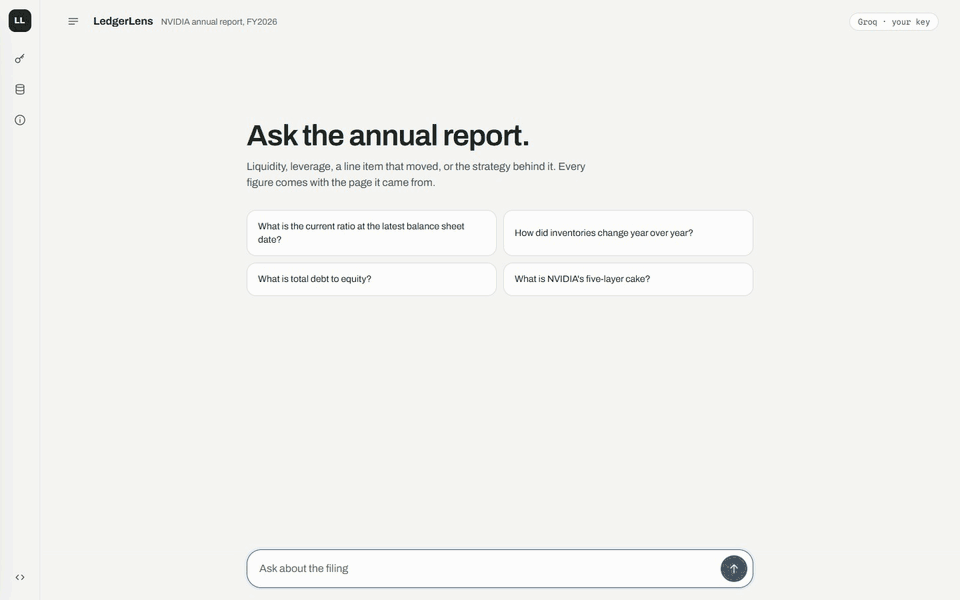
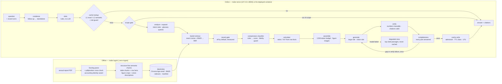
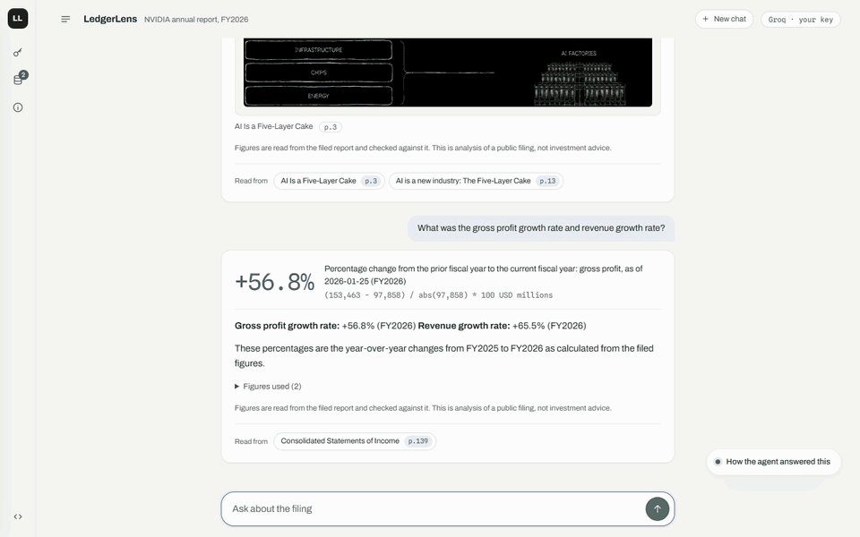
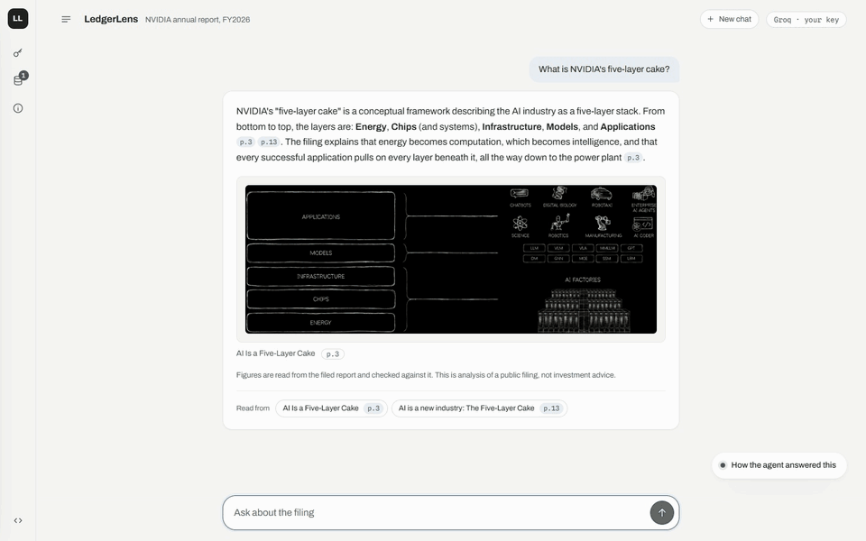
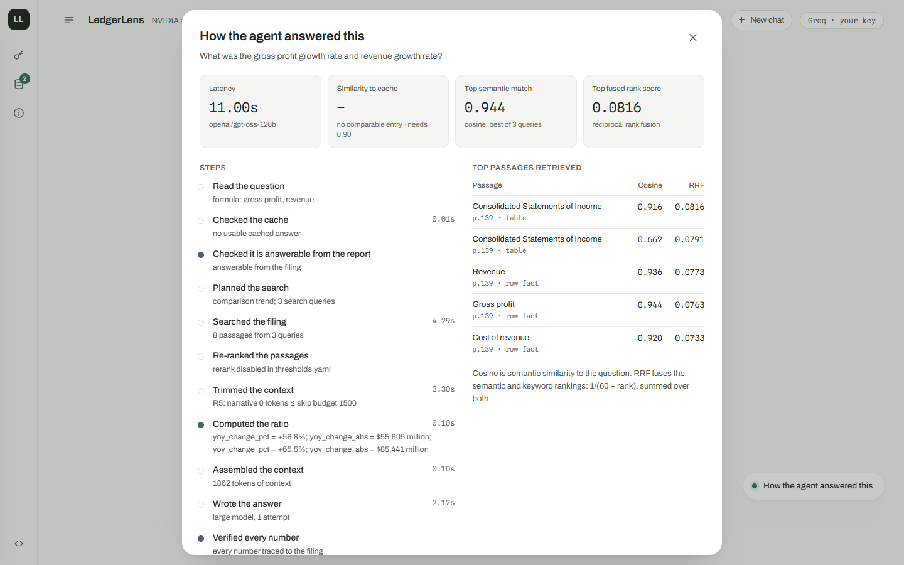
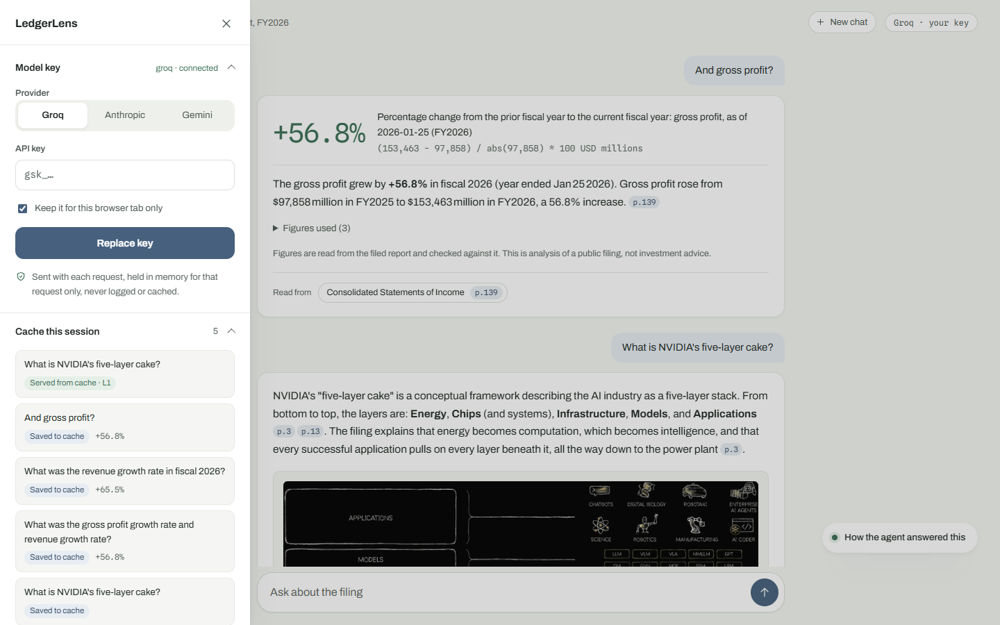
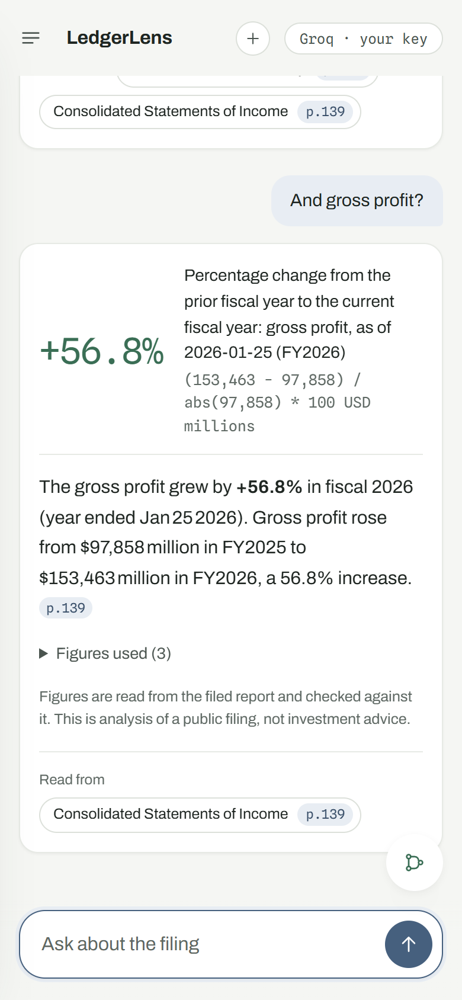

# Advanced Multimodal RAG — Annual Report Analysis

Retrieval-augmented question answering over a company's annual report: narrative text, financial
tables, charts and diagrams in one ChromaDB index; hybrid retrieval with glossary expansion and a
gated reranker; a rules-first compression classifier with a numeric fidelity guard; a two-tier
semantic cache with a slot guard, TTL classes and Redis-style LFU eviction; deterministic ratio
maths; a completeness check that every part of a question was answered; in-session memory for
follow-up questions; page-level citations; a chat page that shows how each answer was built. Built and evaluated on Groq's free tier; every
"advanced" component ships with the measurement that justifies — or rejects — it.

**Live demo: [advanced-multimodal-rag.onrender.com](https://advanced-multimodal-rag.onrender.com)**
— bring your own model key (a free [Groq](https://console.groq.com/keys) key works). The key is
used for your requests only and never stored; see [Live demo and deployment](#live-demo-and-deployment).

<p align="center">
  
</p>

**The demo corpus is NVIDIA's FY2026 combined annual report** (Annual Review + Proxy Statement +
Form 10-K, 175 pages), and the companion documents below are written against it. Nothing in the
pipeline is hard-coded to one issuer: the metric glossary, fiscal calendar, formula registry and
statement validation are all configuration. Turning that into an *upload any annual report* flow
is the next milestone — see [Roadmap and deferred decisions](#roadmap-and-deferred-decisions).

> **Not affiliated with, endorsed by or sponsored by any company whose filings it reads.** It
> answers questions from the document you supply, refuses investment questions by design, and
> produces nothing that is investment advice.

| Document | Purpose |
|---|---|
| [docs/problemstatement.md](docs/problemstatement.md) | What is being built and why; FR/NFR ids |
| [docs/architecture.md](docs/architecture.md) | How, with the decision log (§16) and the evidence index (§12.1) |
| [docs/implementation_plan.md](docs/implementation_plan.md) | Phase-by-phase tasks and exit criteria |
| [docs/reports/](docs/reports/) | Every measurement referenced below |

**Build status (2026-10-04): Phase 9 complete — deployed.** Phases 0–7 built the pipeline and
produced the evidence; Phase 8 hardened it (degrade modes, input limits, startup checks, loopback
guard, coverage gate, model-swap dry run) and rehearsed the runbook from a fresh clone. Phase 9
(decision F2) put it online: bring-your-own-key, a serve-only container on Render's free plan, a
per-visitor rate limit, a redesigned chat page, and a completeness check for multi-part
questions; in-session memory (F3) followed, so a follow-up such as "and gross profit?" is
understood. Advanced models (F1) and memory across sessions remain open.

---

## Contents

- [Advanced Multimodal RAG — Annual Report Analysis](#advanced-multimodal-rag--annual-report-analysis)
  - [Contents](#contents)
  - [What it does, in one request](#what-it-does-in-one-request)
  - [Live demo and deployment](#live-demo-and-deployment)
  - [Runbook: fresh clone to first answer](#runbook-fresh-clone-to-first-answer)
  - [Using it: page, CLI, API](#using-it-page-cli-api)
  - [The cache walkthrough](#the-cache-walkthrough)
  - [Component by component, with the reasoning](#component-by-component-with-the-reasoning)
  - [Evidence: all reports](#evidence-all-reports)
  - [Robustness and security](#robustness-and-security)
  - [Configuration](#configuration)
  - [Model swap: the F1 checklist](#model-swap-the-f1-checklist)
  - [Repository layout](#repository-layout)
  - [Tests, lint, coverage](#tests-lint-coverage)
  - [Roadmap and deferred decisions](#roadmap-and-deferred-decisions)
  - [Known limitations](#known-limitations)
  - [Licence](#licence)

---

## What it does, in one request



Ask *"What is the current ratio as of Jan 25, 2026?"* and the pipeline extracts slots
(`formulas=[current_ratio]`, period FY2026), misses the cache, classifies the intent as
COMPUTATION by rule, retrieves the balance-sheet row facts by hybrid search, computes
`125,605 / 32,163 = 3.91` deterministically from row-fact metadata, hands the model the context
blocks plus the calculation block `[K1]`, verifies that every number in the answer appears in the
context or a calculation, and caches the verified answer as a `filed_fact` with a 30-day TTL. Ask
*"Total current assets over current liabilities at fiscal year-end 2026?"* next and the semantic
cache answers in ~40 ms with zero model calls, because the slots match and the cosine similarity
clears the slot-rich threshold. Ask *"…as of Jan 26, 2025?"* and the period slot blocks the hit.

Headline measurements (details and caveats in [Evidence](#evidence-all-reports)):

| What | Measured | Report |
|---|---|---|
| Numeric exact match on the 48-question golden set | 100 % (POINT_LOOKUP 20/20, COMPUTATION 8/8) | `golden_phase4_claude.md` |
| Retrieval recall@8 (dense → +BM25 → +glossary expansion) | 0.52 → 0.73 → 0.95, zero model calls | `retrieval_ablation.md` |
| Cache false-hit rate on 286 adversarial pairs | 0.0 % (paraphrase hit rate 55.8 %) | `cache_threshold_calibration.md` |
| Correct-hit rate on a 5,230-query replay, capacity 100 | LFU 73.5 % vs LRU 71.6 %, FIFO 66.5 % | `cache_policy_benchmark.md` |
| Compression fidelity violations | 0 over 377 logged requests | `compression_ablation.md` |
| Cache hit p50 / full pipeline p50 | 40 ms / 4.8 s; 479 MB peak RSS; 5.6 s to first request | `local_resource_profile.md` |
| Coverage of the deterministic modules | 97.1 % (gate ≥ 90 % per module) | `coverage_phase8.md` |
| Model-swap dry run (`anthropic`, `gemini` templates) | pass, no network | `model_swap_dry_run.md` |
| Multi-part questions from a live session (6, e.g. "gross profit *and* revenue growth") | every part answered, first attempt (before the fix, each two-part question lost one part) | D-69 · `tests/test_coverage.py` |
| Follow-up questions rewritten correctly (12 scripted shapes: metric swap, period shift, bare *why*, references, comparisons) | 12/12 in two runs, judged by the slot extractor; p50 0.6 s | `conversation_memory.md` |
| Deployed container under Render's free-plan limits (512 MiB, 0.1 CPU, Linux) | 364 MiB at rest, 370 MiB after 3 questions | `.github/workflows/deploy-check.yml` |

---

## Live demo and deployment

**[advanced-multimodal-rag.onrender.com](https://advanced-multimodal-rag.onrender.com)**

1. Open the page; it asks for a model key once. Pick **Groq** (a free key from
   [console.groq.com/keys](https://console.groq.com/keys) is enough), **Anthropic** or **Gemini**,
   paste the key, and press **Test key and start** — one minimal call proves the key before you ask
   anything.
2. Ask a question, or pick a suggestion. While it works you see the pipeline stages; the answer
   arrives with its headline figure, the prose with inline page markers, any diagram it drew on,
   and "Read from" chips that open the cited page of the filing.
3. **How the agent answered this** (the floating bubble) opens the method for the answer on
   screen: latency, similarity to the answer cache, the top semantic (cosine) and fused (RRF)
   scores, every pipeline step with its timing, and the top passages retrieved.
4. Ask a follow-up — "and gross profit?", "why did it fall?", "and the year before?". The page
   remembers the conversation in your browser tab, so the follow-up is understood against it; the
   panel's first step shows how it was read. A reload keeps the conversation; **New chat**
   forgets it.
5. The sidebar holds the key, **Cache this session** (which answers came from the cache, which were
   saved to it) and **About this build** (the evaluation numbers).

<p align="center">
  
</p>

<p align="center">
  
</p>

| The method behind an answer | The sidebar: key and session cache | Phone |
|---|---|---|
|  |  |  |

**Memory.** The conversation lives in your browser tab and nowhere else: the page sends the last
10 turns with each question, in compact form (the question, how it was read, a one-line summary
of the answer), and the server keeps nothing. A question that reads like a follow-up is rewritten
into a standalone question by one short model call; a question that stands on its own costs
nothing extra (D-71).

**Your key.** It travels in a request header over HTTPS, is used for that request only, and is
never written anywhere: the server holds no provider key of its own, refuses any question that
arrives without one, and masks the key by exact value in its logs, traces and usage ledger
(D-66). Search, ratio arithmetic, citation checking and the cache run without a model; the key
pays for the model calls — the written explanation, plus a short follow-up rewrite or self-check
where one is needed — and a cached answer costs no tokens at all. On a free Gemini key the
answers come from `gemini-3.5-flash-lite` (D-72). When a key's daily quota is spent, the page
says so plainly and suggests the API console or another provider; switching provider keeps the
conversation (D-73).

**The free plan.** One instance with 512 MB and a tenth of a CPU, which sleeps after 15 idle
minutes: the first question after a quiet spell waits up to a minute while it wakes. Each visitor
may ask 6 questions a minute and 60 an hour, and at most 2 questions run at once across all
visitors (D-70); over a limit the page says how long to wait.

**How it is deployed.** Render's build cannot run ingestion (Docling and PyTorch are not in the
serving image, and the parse takes ~35 minutes), so the index travels as a GitHub release asset
(`v1.1-index`, 72 MB) and is downloaded at build time. A GitHub Actions workflow builds the same
image and runs it capped to the free plan's limits before anything is deployed; it fails on an
out-of-memory kill, a failed startup check, a reachable admin route, an answer without a key, or
a key shape in the logs. The full runbook, including how to deploy your own copy, is
[DEPLOY.md](DEPLOY.md).

| | Localhost (`make serve`) | Deployed (`deploy/`) |
|---|---|---|
| Key | yours, from `.env` | the visitor's, per request |
| `APP_ENV` / admin routes | `dev` / enabled | `prod` / 404 |
| Request guard | loopback peers only | the platform proxy; per-visitor rate limit |
| `/api/ask` payload | page payload + full `debug` | page payload only |

---

## Runbook: fresh clone to first answer

Requirements: Python 3.11+ (the build machine uses 3.13), several GB of disk for the two
environments (the CPU build of PyTorch dominates), a free [Groq](https://console.groq.com) API
key, and an annual-report PDF — **the corpus is not in this repository**. Download the report you
want to query from the issuer's investor-relations site; the golden set and the demo questions
below assume NVIDIA's FY2026 annual report, saved as `2026_NVIDIA_ANNUAL_REPORT.pdf`. GNU make is
optional — every target is a one-liner shown alongside. Windows paths are `.venv/Scripts/python`;
on macOS/Linux use `.venv/bin/python`.

```bash
git clone https://github.com/brahmalabsai-arch/advanced-multimodal-rag.git
cd advanced-multimodal-rag

# 1. Two environments (D-49): serving never imports PyTorch; Docling lives in .venv-ingest
python -m venv .venv
.venv/Scripts/python -m pip install -r requirements-dev.txt        # serve + tests + eval tools
.venv/Scripts/python -m pip install -e . --no-deps
python -m venv .venv-ingest
.venv-ingest/Scripts/python -m pip install -r requirements-ingest.txt   # Docling, torch CPU, spaCy
.venv-ingest/Scripts/python -m pip install -e . --no-deps
#    (make setup does the same)

# 2. Secrets and the corpus
cp .env.example .env            # set GROQ_API_KEY; keep MODEL_PROFILE=groq_build, APP_ENV=dev
cp /path/to/2026_NVIDIA_ANNUAL_REPORT.pdf data/raw/

# 3. Build the index — about 35 minutes on a free-tier key (see "Why ingestion takes 35 minutes"
#    below); resumable, and a re-run makes zero model calls
.venv-ingest/Scripts/python -m rag.ingest.run                       # make ingest

# 4. Checks (no model calls)
.venv/Scripts/python -m pytest                                     # make test   (~60 s)
.venv/Scripts/python scripts/check_profile.py --profile all --dry-run   # make check-profile

# 5. Serve and ask
.venv/Scripts/python -m uvicorn rag.api.main:app --host 127.0.0.1 --port 8000   # make serve
#    → http://127.0.0.1:8000   (API docs at /docs, readiness at /readyz)
.venv/Scripts/python scripts/ask_cli.py --api "What were NVIDIA's total assets as of Jan 25, 2026?"
```

`/readyz` lists the startup checks (bind address, admin gating, provider keys, index manifest
consistency) and the input limits; if it answers 503 the `error` field names the failing check.
The rehearsal of exactly this sequence from a fresh directory — including two defects it caught —
is recorded in [docs/reports/fresh_clone_rehearsal.md](docs/reports/fresh_clone_rehearsal.md).

**Why ingestion takes 35 minutes, and what makes it faster.** Only ~5 minutes of that is work:
Docling parsing 175 pages on CPU. The other ~30 are spent waiting on the free tier's per-minute
ceilings while ~150 enrichment calls go out — one per table summary (`small` role) and one per
figure description (`vision` role). The vision role is the bottleneck: Groq's free tier allows it
**1,000 output tokens per minute**, charged against the *requested* `max_tokens`, so 43 figure
descriptions alone take ~21 minutes. Table summaries add ~8 minutes under the 8K tokens-per-minute
bucket. The client paces every request against the limits declared in `config/models.yaml`
(30 RPM / 8K TPM / 1,000 OTPM on vision / 7K ITPM / 200K tokens per day per model — the last two
are enforced but absent from Groq's console table, hence decision D-52). On a paid tier those
ceilings rise: copy the current values from the provider console into the profile's `pacing`
block and ingestion becomes bound by the parse instead. Nothing else changes — pacing is
configuration, not code. Every LLM result is cached by content hash under `data/parsed/enrichment`,
so a second `make ingest` costs **zero** calls, and a run interrupted by a daily quota resumes
where it stopped.

Ingestion stages, each writing plain files so later stages never import Docling:

| Stage | Module | Output |
|---|---|---|
| parse | `rag.ingest.parse` | `data/parsed/docling.json` (skipped when the PDF hash is unchanged) |
| elements | `rag.ingest.elements`, `sections.py` | `elements.jsonl` — every text / heading / table / picture with page, bbox, section, statement |
| validate | `rag.ingest.validate` | `statements.json` — pdfplumber rows for the three statements cross-checked cell by cell; **ingestion stops if total assets ≠ total liabilities + equity** |
| figures | `rag.ingest.figures` | figure candidates, 200-DPI crops, page thumbnails |
| chunk | `chunk_semantic.py`, `tables.py`, `figures.py`, `enrich.py` | `chunks.jsonl` — semantic text chunks (120–450 tokens), table chunks with one-line summaries (`small` role), row facts with numeric metadata, figure chunks described by the `vision` role |
| index | `rag.ingest.index` | `data/index/` — Chroma `report_chunks`, `bm25.pkl`, sentence sidecars, `manifest.json` with `corpus_version` |

`--stage <name>` runs one stage; `--force-parse` re-runs Docling; `--no-llm` chunks without Groq.

---

## Using it: page, CLI, API

**Page (`http://127.0.0.1:8000`).** The same page as the live demo (see above): chat with
in-session memory, figures under the answer, citation chips that open the page, the "How the
agent answered this" panel and the session cache list. Locally it asks for a key too; `?demo=1` answers from a canned payload
with no key and no network. The page and its payload contract are documented in
[frontend/README.md](frontend/README.md).

The Phase 6–8 developer panels (cache, debug, ops) were retired with the Phase 9 page; their data
is still served in `dev`. `/api/ask` returns the full pipeline payload under `debug` — slots,
scope decision, intent rule, expansion queries, dense/BM25/RRF scores per candidate, rerank gate,
compression decision per chunk, calculator inputs, verification, completeness, tokens and
latency per node — and the admin routes below expose the cache, the dev clock and the ops
aggregation.

**CLI.**

```bash
.venv/Scripts/python scripts/ask_cli.py "How much did goodwill grow year-over-year?"   # in-process
.venv/Scripts/python scripts/ask_cli.py --api --json "What is the quick ratio?"        # via server
.venv/Scripts/python scripts/inspect_index.py --bm25 "inventories" -k 5
.venv/Scripts/python scripts/inspect_index.py --dense "inventories at fiscal year end 2026"
```

**API.**

| Endpoint | Purpose |
|---|---|
| `POST /api/ask` `{question, bypass_cache, history}` | Headers `X-Provider` + `X-Provider-Key` (required when deployed). `history` is the conversation's recent turns (`[{question, standalone, summary}]`, optional). The page payload: answer, `standalone_question`, headline figure, citations with inline refs, figures, trace steps and metrics, `incomplete`, `degraded`, `quota`; plus `debug` in `dev` |
| `POST /api/key/test` | Same headers; one minimal call proves the key (`200 {model}`, `401` rejected) |
| `GET /api/trace/{request_id}` | The trace line written for that request (`data/logs/traces.jsonl`) |
| `GET /api/figures/{id}`, `GET /api/pages/{n}` | Figure crops and page thumbnails |
| `GET /healthz`, `GET /readyz` | Liveness; readiness with startup checks, corpus version, limits |
| `GET /api/admin/stats` | Ops aggregation over traces + usage ledger (dev only) |
| `GET /api/admin/cache/stats`, `/cache/entries`, `POST /cache/purge`, `POST /cache/sweep` | Cache inspection and housekeeping (dev only) |
| `GET/POST /api/admin/clock` | Dev clock offset for TTL / LFU testing (dev only, ≤ 400 days) |

Admin routes answer 404 unless `APP_ENV=dev`. Every request writes a trace line; every model
attempt writes a ledger line (`data/logs/llm_usage.jsonl`); every compression decision writes to
`data/logs/compression_decisions.jsonl`.

---

## The cache walkthrough

The ten steps of plan Phase 6 exercise every layer of the cache (§5): L1 exact hit, L2 semantic
hit after a restart, paraphrase hit, period-slot miss, bypass, version-key invalidation and
revert, time-anchored 1-day TTL, 30-day TTL with the sweeper, purge. Scripted:

```bash
.venv/Scripts/python scripts/cache_walkthrough.py                 # in-process, real models, ~6 full runs
.venv/Scripts/python scripts/cache_walkthrough.py --api           # against a running dev server
.venv/Scripts/python scripts/cache_walkthrough.py --report docs/reports/cache_walkthrough.md
```

The steps: ask G1, ask it again (L1), restart and ask again (L2 → promoted to L1), ask a
paraphrase (L2, similarity ≈ 0.87), ask the FY2025 variant (MISS: period guard), bypass, edit
`retrieval.final_k` in `thresholds.yaml` and restart (MISS: `retrieval_config_hash` changed;
revert → hit again), ask "When is NVIDIA's annual meeting?" and move the dev clock +1 day
(time-anchored TTL expired), +30 days and ask G1 (30-day TTL expired; the sweeper removes it),
reset and purge. The browser panel that drove these by hand was retired with the Phase 9 page;
`--api` drives the same admin endpoints (`/api/admin/clock`, `/api/admin/cache/*`) on a dev
server. In the page itself, the sidebar's **Cache this session** and the "How the agent answered
this" panel show each answer's tier and similarity. The last scripted pass is
[docs/reports/cache_walkthrough.md](docs/reports/cache_walkthrough.md) (10/10).

---

## Component by component, with the reasoning

Each row names the decision-log entries (`architecture.md` §16) and the report that carries the
measurement. Null and negative results are kept on purpose (rule G5).

| Component | What was built | Why this way, and what the evidence says | Decisions · evidence |
|---|---|---|---|
| **Parsing** | Docling for layout + tables + pictures, pdfplumber as an independent second parser for the three statements, accounting-identity assertion | Financial tables mis-parse silently; two parsers that agree cell by cell, plus `assets = liabilities + equity`, turn a silent error into a stopped ingestion | D-16 · `ingestion_phase1.md` |
| **Chunking** | Structure first (section, statement, table), then sentence-embedding boundaries inside narrative (120–450 tokens, corpus-level p90 split) | Pure semantic chunking crosses table and section boundaries; structure-first keeps a row with its table and a note with its heading | D-17, D-53 · `ingestion_phase2.md` |
| **Tables and row facts** | Parent table chunk + one row-fact child per line item with `value_fy2026`, `value_fy2025`, unit, period end | Numbers as metadata make the calculator deterministic and let retrieval land on the exact row; tables as prose lose the period | D-18, D-26 · `ingestion_phase2.md` |
| **Figures** | Detect → rasterise → classify → describe with the vision role; photos and logos dropped; charts linked to a companion table; image passthrough to the vision model at answer time | No image-embedding model: descriptions retrieve well on this corpus and the companion table carries the exact numbers; vision-unavailable falls back to description + table | D-19, D-41, D-55 · `ingestion_phase2.md` |
| **Embedder** | `bge-small` (fastembed ONNX, 384-d) locked after a gate against `bge-base` | The gate measured no retrieval gain from the larger model on this corpus; small keeps serving CPU-only and fast | D-34, D-47 · `embedder_gate.md` |
| **Dense search** | Exact cosine over in-memory vectors; Chroma stays the persistent store | Chroma's HNSW dropped the true top hit on the 689-chunk index in one process and not another; brute force is ≈ 1 ms and deterministic (NFR-9) | D-54 |
| **Hybrid retrieval** | Dense top-30 ⊕ BM25 top-30 (finance-aware tokenizer) → RRF (k = 60) → top-8 | Recall@8 0.52 dense-only → 0.73 hybrid; line-item names are lexical | D-21 · `retrieval_ablation.md` |
| **Query understanding** | Rule-based slots (325-synonym glossary, fiscal calendar, `AMBIGUOUS_<year>`), rule-based intent (7 classes), one combined small-LLM call only when rules are unsure | Rules classified 46/48 golden questions correctly with zero model calls; the LLM fallback never fired on the golden set | D-22, D-56 · `retrieval_ablation.md` |
| **Query expansion** | Glossary / decomposition queries phrased like row facts with statement + modality pre-filters, numeric intents only; HyDE built and **off** | Expansion took recall@8 0.73 → 0.95 and MRR 0.46 → 0.91 with zero model calls; HyDE added nothing at ≈ 1.8 calls per question | D-23 (null), D-57 · `retrieval_ablation.md` |
| **Reranker** | Gate (S1–S3) + `bge-reranker-base`, MiniLM as alternative; **off by default** | Measured negative: recall@8 0.95 → 0.91 gated, 0.86 always, ≈ 5 s per reranked question on CPU; kept for a larger corpus | D-24 (negative), D-25 · `retrieval_ablation.md` |
| **Calculator** | Formula registry (`formulas.yaml`), whitelisted AST evaluator, inputs from row-fact metadata only, missing inputs reported never guessed | A language model must never do the arithmetic in a finance tool; the block `[K1]` is verbatim in the prompt and the verifier accepts its numbers | D-26, D-39 · `baseline_phase3.md` |
| **Compression classifier** | LLM-free: Stage A hard rules (protect tables, row facts, figure data; skip under budget) → Stage B scored decision (`KEEP` / `ROW_SELECT` / `DEDUPE` / `EXTRACT_SENTENCES` / `EXTRACT_LLM`) → break-even test for the LLM compressor → numeric fidelity guard with fallback | On this corpus and budget the classifier compresses 15/48 queries, saves 6 % candidate tokens with **zero** fidelity violations and no accuracy loss; "always compress" doubled latency and cut keyword coverage 92 → 72 % | D-10–D-15, D-58 · `compression_ablation.md` |
| **Stage C (learned)** | Logistic + GBM trained on 54 labelled decisions; NumPy scorer and weights shipped behind `compression.stage_b: learned` | Precision 0.919 vs rules 0.881 vs always-compress 0.852 — but only 8 negative labels, so the adoption floor (≥ 20) fails; **not adopted**, one config change away | D-61 · `stage_c_classifier.md` |
| **Semantic cache** | L1 exact (LRU + TTL, `cachetools`) + L2 semantic in Chroma; hard slot guard with 8 keys (period, metric, formula, entity, negation, ask type, aggregation, topic); similarity 0.85 slot-rich / 0.90 slot-poor; admission only for verified, cited, confident, self-contained answers | Similarity alone cannot carry precision here: `bge-small` scores period swaps at 0.90–0.99, above genuine paraphrases; the guard takes false hits to 0.0 % on 286 adversarial pairs while keeping 55.8 % of paraphrase hits | D-01–D-08, D-28, D-31, D-59, D-60 · `cache_threshold_calibration.md`, `cache_walkthrough.md` |
| **TTL classes** | `filed_fact` 30 d · `analytical` 7 d · `time_anchored` 1 d (shortened to the event date) · `negative` 1 d · `low confidence` not cached; version keys (corpus, embedder, retrieval config, prompts, generator model) invalidate independent of TTL | Expiry, invalidation, admission and eviction are separate layers (the "TTL strategy" question is four questions); testable with the dev clock | D-01, D-05, D-06, D-46 · `cache_walkthrough.md` |
| **Eviction** | Redis `volatile-lfu` semantics: Morris counter (log factor 10, init 5), 1-day decay, exact victim choice, stale-version records first; benchmarked against LRU, FIFO, MRU, `volatile-ttl`, random, TTL-only, LFU-no-decay | Best correct-hit rate at capacity 100 (73.5 %); LRU wins by 5.5 pp at capacity 25 only, short of the promotion rule (≥ 5 pp at ≥ 2 capacities); eviction is inert at demo scale | D-09, D-30, D-32 · `cache_policy_benchmark.md` |
| **Generation contract** | JSON `Answer` (markdown, figures used, citations, confidence, answer class); Groq JSON mode + Pydantic validation + one corrective retry; `large` role text, `vision` role with bounded images | The verifier needs structure; citations are mandatory; the vision request is sized to Groq's OTPM/ITPM buckets so it is not rejected client-side | D-33, D-38, D-52, D-55 · `generator_check.md` |
| **Verifier** | Every number in the answer must appear in the context or a calculation (percent form of a ratio allowed); every citation must exist; one regeneration on failure, then `low` confidence + warning | Faithfulness is enforced, not hoped for — which is why RAGAS faithfulness is 1.00 and the interesting RAGAS number is context precision | D-39 · `ragas_claude.md` |
| **Completeness check** | After the verifier: rules first (every calculation result and every requested value must appear in the answer), then — only for a multi-part question the rules cannot fully see — one `small`-role self-check that lists the asks and flags any left unanswered. A gap shares the verifier's single regeneration, with a note naming the block that holds the value; still incomplete → stated on the page, never cached. The calculator computes year-over-year changes for *every* metric named, and bare "profit" reads as net income | The verifier passes an answer that skips half the question, because every number it *does* state is traceable. A live session showed exactly that: "growth of profit and revenue" answered one part and called the other "not in the filing", and which part survived depended on word order. After the fix, all six questions from that session were answered in full on the first attempt | D-69 · `tests/test_coverage.py` |
| **In-session memory** | The page keeps the conversation in the visitor's tab and sends the last 10 turns (compact, ≤ 1,500 tokens) with each question; a first node, `condense`, decides by rules whether the question needs them and only then rewrites it into a standalone question with one `small` call; every later node — the cache included — works on that question. The rewrite is the first step of the method panel | A stateless server keeps the BYOK promise (nothing stored) and survives the free instance sleeping; keying the cache on the standalone question means "and gross profit?" can never hit by its wording. The evaluation caught two defects before release: the rewrite dropped the *growth rate* when only the metric changed, and Groq's JSON mode rejected rewrites outright — now plain text | D-71 · `conversation_memory.md`, `tests/test_condense.py` |
| **Model layer** | Roles (`small`, `large`, `vision`) resolved through profiles in `models.yaml`; client-side RPM/TPM/OTPM/ITPM pacing; retries honouring `retry-after`; usage ledger; lazy provider imports | Groq free-tier limits are per model and partly undocumented (D-52); pacing on the client is what made the build fit; the swap to Anthropic/Gemini is configuration (dry-run validated) | D-27, D-45, D-50, D-52 · `model_swap_dry_run.md` |
| **Degrade modes** | Model failure → retrieval-only view with citations, flagged `degraded`, never cached; vision failure → text model on description + table | The 429 and the provider-400 paths were both hit repeatedly during evaluation; a finance user still gets the cited passages and the calculator output | §13 · `tests/test_hardening.py` |
| **Page** | FastAPI + one uvicorn worker + vanilla HTML/CSS/JS (vendored marked + DOMPurify, self-hosted fonts): chat thread, figures under the answer, a "how the agent answered" panel, a sidebar for the key, the session cache and the build's numbers | One process, one L1, one Chroma writer; no build step; no third-party request at runtime, which matters on a page that asks for a key. The debug payload remains the acceptance surface in `dev` (NFR-10) | D-33, D-44, D-48 · `frontend/README.md` |
| **Bring-your-own-key** | `X-Provider` / `X-Provider-Key` per request; a client built per request with every server key blanked; the key masked by exact value in logs, traces and ledger; one pipeline per provider over one shared index, cache entries separated by provider | A public URL on the owner's key would let any visitor spend the owner's quota; BYOK makes the server hold no secret at all | D-66, D-67, D-68 · `tests/test_byok.py` |
| **Rate limit** | Per visitor address: 6 questions a minute, 60 an hour, 5 key checks a minute; at most 2 questions in flight across visitors; address from Cloudflare's `CF-Connecting-IP`, never the client-controlled `X-Forwarded-For` | BYOK protects the token quota, not the CPU: a question spends 1–4 s of a 0.1-CPU instance before any model call, so one looping client would starve every other visitor | D-70 · `tests/test_ratelimit.py` |
| **Deployment** | Serve-only Docker image (no Docling, no PyTorch), index as a release asset, Render blueprint, CI that runs the image under the free plan's limits before deploy | The build cannot run ingestion; the memory headroom (~140 MiB) is measured on Linux under the real cap rather than estimated on a laptop | D-68 · `DEPLOY.md` |

---

## Evidence: all reports

| Question | Report |
|---|---|
| Did the parse get the statements right? | [ingestion_phase1.md](docs/reports/ingestion_phase1.md) |
| What is in the index, and what did enrichment cost? | [ingestion_phase2.md](docs/reports/ingestion_phase2.md) |
| How good was the baseline before any "advanced" component? | [baseline_phase3.md](docs/reports/baseline_phase3.md) |
| Which embedder? | [embedder_gate.md](docs/reports/embedder_gate.md) |
| Does query expansion help? Does reranking? | [retrieval_ablation.md](docs/reports/retrieval_ablation.md) |
| Which Groq generator? | [generator_check.md](docs/reports/generator_check.md) |
| Does the Phase 4 pipeline regress on the golden set? | [golden_phase4_claude.md](docs/reports/golden_phase4_claude.md) |
| Does compression pay for itself? | [compression_ablation.md](docs/reports/compression_ablation.md) |
| Where are the cache thresholds from? | [cache_threshold_calibration.md](docs/reports/cache_threshold_calibration.md) |
| Does the cache behave as designed? | [cache_walkthrough.md](docs/reports/cache_walkthrough.md) |
| Is the eviction policy the right one? | [cache_policy_benchmark.md](docs/reports/cache_policy_benchmark.md) |
| Should Stage B be learned? | [stage_c_classifier.md](docs/reports/stage_c_classifier.md) |
| Is the answer grounded in the context? | [ragas_groq.md](docs/reports/ragas_groq.md) (4/16, Groq judge) · [ragas_claude.md](docs/reports/ragas_claude.md) (full subset) |
| What does it cost to run locally? | [local_resource_profile.md](docs/reports/local_resource_profile.md) |
| Are the non-functional requirements met? | [nfr_results.md](docs/reports/nfr_results.md) |
| Are the deterministic modules covered? | [coverage_phase8.md](docs/reports/coverage_phase8.md) |
| Do the model profiles validate? | [model_swap_dry_run.md](docs/reports/model_swap_dry_run.md) |
| Are follow-up questions understood? | [conversation_memory.md](docs/reports/conversation_memory.md) |
| Does the runbook work from a fresh clone? | [fresh_clone_rehearsal.md](docs/reports/fresh_clone_rehearsal.md) |

Reproduce any of them (model-free ones first):

```bash
.venv/Scripts/python eval/run_eval.py --retrieval-only --name retrieval   # recall@8 / MRR, no model calls
.venv/Scripts/python eval/retrieval_ablation.py                           # the 8 retrieval arms
.venv/Scripts/python eval/cache_threshold_calibration.py                  # guard + thresholds, no model calls
.venv/Scripts/python eval/cache_benchmark.py                              # 9 policies × 5 capacities, ~8 s
.venv/Scripts/python eval/train_classifier.py                             # Stage C, no model calls
.venv/Scripts/python eval/nfr_results.py                                  # NFR table from files on disk
.venv/Scripts/python scripts/coverage_gate.py                             # coverage gate
.venv/Scripts/python eval/run_eval.py --name golden                       # golden set, ~150K Groq tokens
.venv/Scripts/python eval/compression_ablation.py                         # three arms, model calls
.venv/Scripts/python eval/ragas_eval.py --name ragas_groq --resume        # judge calls
.venv/Scripts/python eval/resource_profile.py --purge-first               # 50 mixed queries
```

Evaluation always runs with `bypass_cache=true` and a fixed request-id prefix (rule G8), so
cached answers never inflate accuracy and evaluation traffic is separable in the logs.

---

## Robustness and security

| Concern | Behaviour | Where |
|---|---|---|
| Model provider fails (429 past the retry budget, 400, outage) | `generate` returns a **retrieval-only view**: the top cited passages with page references and any calculator output, `confidence: low`, `degraded: true`, a warning that names the HTTP status; never admitted to the cache; every node that ran keeps its latency. A cached answer, when one exists, is served *before* the model is called | `graph.py` `degraded_answer`, §13 |
| Vision model unavailable | The `large` text model answers from the figure description + companion table; the figure is still shown | `generate.py`, D-55 |
| Bad input | 422 for empty / whitespace, over `server.max_question_chars` (1,000), control characters (binary pasted), or no letter or digit | `routes_ask.py` `validate_question` |
| Slow request | 504 after `server.request_timeout_seconds` (120); the worker thread finishes and still writes its trace | `routes_ask.py` |
| Startup | Checks: `bind` is loopback unless deployed (fatal), `public` — a public deploy without `BYOK_ONLY`, or with admin routes on, refuses to start (fatal), `admin` routes disabled outside dev, `secrets` present for the active profile's providers (names only; under `BYOK_ONLY` none are needed and a stray one is named), `index` manifest present and self-consistent — `corpus_version` recomputes, `chunks_total` matches `chunks.jsonl`, embedder alias matches `thresholds.yaml` (fatal). Results in `/readyz` | `api/checks.py` |
| Network exposure | Localhost: bound to `127.0.0.1`, a request from a routable peer is refused with 403. Deployed: behind the platform proxy, every question needs the visitor's key (401 without), per-visitor rate limit and an in-flight cap (429 / 503 with `Retry-After`). Admin and dev-clock routes 404 unless `APP_ENV=dev` | `api/main.py`, `api/ratelimit.py`, NFR-12 |
| Secrets | Server keys are `SecretStr`, only in `.env` (gitignored), and absent from the deployed container; a visitor's key lives for one request and is masked by exact value; logs also redact key shapes (`gsk_…`, `sk-ant-…`, `AIza…`); the ledger and trace store counts and ids, never prompts | `api/byok.py`, `core/logging.py`, `tests/test_byok.py`, `tests/test_logging_redaction.py` |
| Spent daily quota | Told apart from a per-minute limit (Groq's "per day" limits, Google's per-day quota id) and said plainly: the key's daily limit has been hit — check the API console or change the provider, and the chat is kept. Not retried; the turn does not enter the conversation memory | `rag/llm.py`, `api/byok.py`, D-73 |
| Incomplete answer | A part of the question left unanswered is regenerated once, then stated on the page (`incomplete`) and never cached | `query/coverage.py`, D-69 |
| Prompt injection in the PDF | Context is data: answer-only-from-context contract, verifier, DOMPurify on render | `generate.py`, `frontend/` |
| Silent financial error | Test-first deterministic modules, coverage gate ≥ 90 % each (97.2 % overall) | `scripts/coverage_gate.py` |

---

## Configuration

| File | Contents |
|---|---|
| `.env` | `GROQ_API_KEY`, `MODEL_PROFILE` (default `groq_build`), `APP_ENV` (`dev` / `test` / `prod`); `ANTHROPIC_API_KEY`, `GOOGLE_API_KEY` only after F1. Deployment flags `BYOK_ONLY` and `PUBLIC_DEPLOY` (set in the image, never locally) |
| `config/models.yaml` | Profiles: `groq_build` (active), `groq_qwen_large` (generator check), `anthropic` and `gemini` (validated templates). Per-model `pacing` (rpm / tpm / otpm / itpm), `provider_kwargs`, optional `price_usd_per_mtok` |
| `config/app.yaml` | Bind address and port, `max_question_chars`, `request_timeout_seconds`, `rate_limit` (per-visitor windows, in-flight cap, trusted client-address headers; deployed only), `conversation` (turns and tokens a follow-up rewrite may see: 10 / 1,500), dev-clock enablement, data paths |
| `config/thresholds.yaml` | Retrieval (embedder lock, k's, RRF), expansion (glossary, filters, HyDE off), rerank (off, gate), compression (mode, Stage B thresholds, `stage_b: rules\|learned`), completeness (rules, self-check), cache (thresholds, TTL seconds, L1 size, eviction constants, sweep interval) |
| `config/glossary.yaml` | 325 metric synonyms, formula cues, `lexicons.ask_type`, `lexicons.topic_terms` |
| `config/fiscal_calendar.yaml` | Fiscal year ends and the bare-year resolution rule |
| `config/formulas.yaml` | Deterministic formula registry for the calculator |

Model ids are configuration, never code. Groq retired its Llama 3.x / Llama 4 Scout free-tier
models before this build, so `groq_build` uses `openai/gpt-oss-20b` (small),
`openai/gpt-oss-120b` (large) and `qwen/qwen3.8-27b` (vision) — D-50. Groq's free tier also
enforces per-model output-tokens-per-minute and a rolling 200K tokens/day that the console does
not show; the pacing layer models both (D-52).

---

## Model swap: the F1 checklist

Switching provider is configuration only (NFR-11). The dry run below is what "validated
template" means: `models.yaml` validates with the profile active, each role resolves, the
provider chat-model constructor accepts the profile's `provider_kwargs`, budgets fit the pacing
limits, and the structured-output mode matches the provider — with no network call.

```bash
.venv/Scripts/python scripts/check_profile.py --profile anthropic --dry-run
.venv/Scripts/python scripts/check_profile.py --profile gemini --dry-run
.venv/Scripts/python scripts/check_profile.py --profile all --report     # → docs/reports/model_swap_dry_run.md
```

When the decision to switch is taken:

1. **Billing and keys.** Enable API billing for the provider; add `ANTHROPIC_API_KEY` and/or
   `GOOGLE_API_KEY` to `.env`; `pip install -r requirements-future.txt` into `.venv`.
2. **Model ids and limits.** Verify the ids in `models.yaml` against the provider's current list
   (the Gemini ids in particular); replace the placeholder `pacing` with the account's real
   RPM/TPM. Re-run `check_profile.py --profile <name> --live` (one `small` call).
3. **Prices.** Fill `price_usd_per_mtok` for every role so the compression break-even test runs
   in price mode instead of quota mode (§6.6); the dry run warns until this is done.
4. **Switch.** `MODEL_PROFILE=anthropic` (or `gemini`) in `.env`; restart. Version keys change
   with the generator model, so the semantic cache invalidates itself (§5.7) — `purge stale`
   removes the old records early.
5. **Structured output.** Templates use `structured_output: native`; the client currently sends
   the schema instruction and validates the JSON, which works on both providers (the Phase 4
   evaluation runs used exactly this). Adopting the provider's native structured-output API is
   the one code change on the F1 list.
6. **Re-measure.** Golden set (`eval/run_eval.py --name golden_<profile>`), RAGAS
   (`eval/ragas_eval.py`) and the generator bake-off (D-38) per candidate; then compression
   calibration, since the context budget rises from 2,500 to 6,000 tokens; optionally re-enrich
   figures with the stronger vision model (changes `corpus_version`; the cache invalidates
   automatically).
7. **Record.** Update the reports and the decision log (D-38, D-45).

A clone installs only `langchain-groq`; the Anthropic and Google packages live in
`requirements-future.txt` and are installed at step 1. The dry run reports a missing provider
package as a warning, not a failure — the template is still valid.

---

## Repository layout

```
config/         models.yaml · app.yaml · thresholds.yaml · glossary.yaml · fiscal_calendar.yaml · formulas.yaml
data/           raw/ parsed/ index/ cache/ logs/     (gitignored; you supply the PDF, `make ingest` builds the rest)
docs/           problemstatement.md · architecture.md · implementation_plan.md · reports/ (19 reports)
deploy/         Dockerfile (serve-only) · render.yaml (Render blueprint)       DEPLOY.md is the runbook
.github/        workflows/deploy-check.yml — the image under the free plan's limits, before any deploy
frontend/       index.html app.css app.js fonts/ vendor/ (marked, DOMPurify) demo-answer.json — no build step
src/rag/
  core/         settings.py config.py logging.py tokens.py pacing.py ledger.py traces.py clock.py console.py
                schema.py (chunk metadata contract) embeddings.py (fastembed) bm25.py
  llm.py        role-based model layer: text() · json() · vision_json(); pacing, retries, ledger
  ingest/       run.py parse.py elements.py sections.py validate.py figures.py report.py
                sentences.py chunk_semantic.py tables.py enrich.py index.py
  query/        store.py slots.py scope.py analyze.py retrieve.py rerank.py assemble.py generate.py verify.py
                coverage.py (completeness check) · condense.py (follow-up → standalone question)
  calc/         calculator.py
  compress/     features.py classifier.py compressors.py fidelity.py pipeline.py classifier_weights.json
  cache/        records.py service.py l1.py l2.py lfu.py ttl.py admission.py versions.py sweeper.py
  api/          main.py routes_ask.py routes_admin.py ops.py checks.py
                byok.py pipelines.py payload.py (page payload) ratelimit.py
  graph.py      LangGraph pipeline (slots → cache → scope → analyze → retrieve → rerank → compress
                → calculate → assemble → generate → verify → complete → cache write; condense first;
                degrade path)
eval/           golden.jsonl (48 questions) · run_eval.py · retrieval_ablation.py · compression_ablation.py
                build_cache_pairs.py · cache_threshold_calibration.py · cache_benchmark.py · train_classifier.py
                ragas_eval.py · resource_profile.py · nfr_results.py · write_report.py · conversation_memory.py
                results/ (gitignored)
scripts/        smoke_llm.py · inspect_index.py · ask_cli.py · cache_walkthrough.py · check_profile.py · coverage_gate.py
                package_index.py (index → release asset)
tests/          unit + API tests with a scripted model (no network); ingestion tests read the PDF when present
```

---

## Tests, lint, coverage

```bash
.venv/Scripts/python -m pytest                    # make test      571 tests, ~60 s, no network
.venv/Scripts/python -m ruff check . && .venv/Scripts/python -m ruff format --check .   # make lint
.venv/Scripts/python scripts/coverage_gate.py     # make coverage  ≥ 90 % per deterministic module
.venv/Scripts/python scripts/smoke_llm.py         # make smoke     3 Groq calls, one per role
```

Tests never read the developer's `.env` (the conftest clears the variables); model calls are
scripted with a fake chat model. Tests marked `needs_index` skip until `make ingest` has run.

---

## Roadmap and deferred decisions

The first row is where this project is going; the rest are decisions the backend-complete gate
deliberately left open (`architecture.md` §14.4), each with the evidence it needs already in hand.

| Next / deferred | State today, and what it needs |
|---|---|
| **Any annual report, supplied by the user** — upload a PDF, ingest it, query it | Not built. The pipeline is already config-driven for this: the metric glossary, fiscal calendar, formula registry, section tagger and statement validator are YAML, not code, and `corpus_version` keys the index and the cache. What a second issuer needs: its fiscal calendar and synonym set, statement detection beyond the three US-GAAP statements this corpus carries, and its own golden set before any accuracy claim transfers |
| **F1 — advanced models.** Provider, generator, whether to re-enrich figures | `model_swap_dry_run.md` (templates valid), `golden_phase4_claude.md` and `ragas_claude.md` (what Claude Sonnet 5 does on this pipeline), `generator_check.md` (Groq internal), the F1 checklist above |
| **F2 — hosting. Done (Phase 9).** | Render free plan, serve-only container, bring-your-own-key, per-visitor rate limit, CI under the real memory cap — see [Live demo and deployment](#live-demo-and-deployment) and `architecture.md` §14.4. Open: a paid instance (no sleep, more CPU) if traffic warrants it; cache persistence across restarts |
| **F3 — multi-turn. In-session memory done (D-71).** | Follow-ups are rewritten against the conversation the page keeps in the visitor's tab; 12/12 scripted follow-up shapes correct. Open: memory across sessions or devices, which would need accounts and server-side storage — a different privacy model from BYOK |
| **Stage C adoption.** Whether to gather ≥ 20 negative labels and switch `compression.stage_b: learned` | `stage_c_classifier.md` |
| **Reranker.** Whether a larger corpus changes the negative result | `retrieval_ablation.md`; the gate and both rerankers are still in the code |

---

## Known limitations

- **The measurements are corpus-specific.** Every number above was produced on one 175-page
  annual report. They say the pipeline works on this document; they do not transfer to another
  issuer without re-running the evaluations.
- **Golden set.** 13 of 48 rows still carry `review_status: needs_human_review` (mostly
  explanatory and visual questions), and the RAGAS context precision/recall figures are judged
  against those reference answers.
- **Judges are same-family.** RAGAS scores come from a Groq or Claude judge reading the same
  context; treat them as a smoke test (NFR-2 indicative).
- **The cache benchmark workload is synthetic.** Policy *comparisons* are sound (same log for
  every policy); absolute hit rates are not a traffic forecast.
- **Evaluation used the `anthropic` profile** for the full golden, compression and RAGAS runs
  when the Groq daily window was exhausted (D-45 note); serving stayed on `groq_build`. The Groq
  golden re-run is partial (34/48).
- **Memory is per browser tab.** Closing the tab, or **New chat**, forgets the conversation;
  nothing is kept across sessions or devices. A follow-up whose rewrite fails is answered as typed,
  and the method panel says so.
- **Providers.** Evaluation and the server-side build ran on **Groq's free tier** (F1). The Gemini
  profile was checked live on a five-turn conversation (D-72), not on the golden set; the
  Anthropic profile has not been re-checked live since the Phase 4 evaluation.
- **The demo runs on Render's free plan**: one instance, a tenth of a CPU, asleep after 15 idle
  minutes. Rate-limit counters and the answer cache live in memory or on the container's disk
  and reset on every restart or redeploy.
- **Lexicons are hand-written** (`ask_type`, `topic_terms`, 325 synonyms) and checked against the
  report, not against real user phrasings; a missing cue costs a cache miss, never a wrong hit.
- Before quoting a number from this repository, read the report it comes from: each one names its
  judge, its sample size and its caveats.

---

## Licence

MIT — see [LICENSE](LICENSE).

The corpus is not part of this repository. Annual reports, proxy statements and Form 10-K
filings remain the property of their issuers; `data/` is gitignored so that none is redistributed
here, and you supply the PDF yourself.
