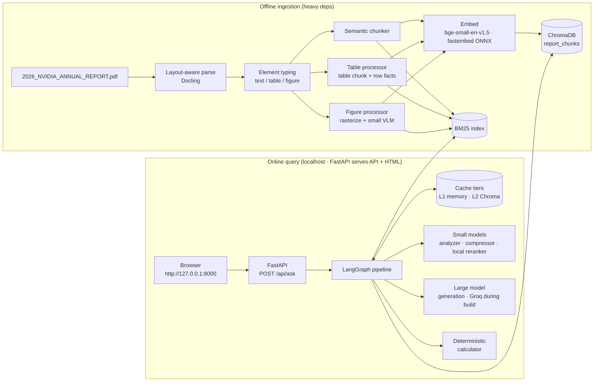
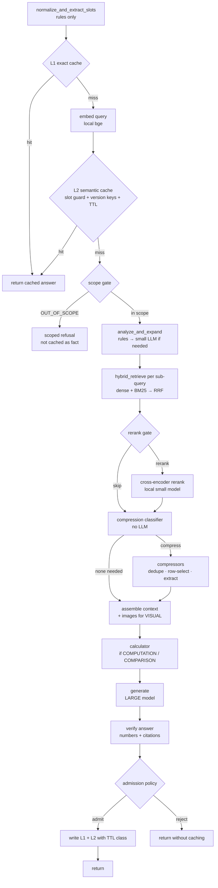
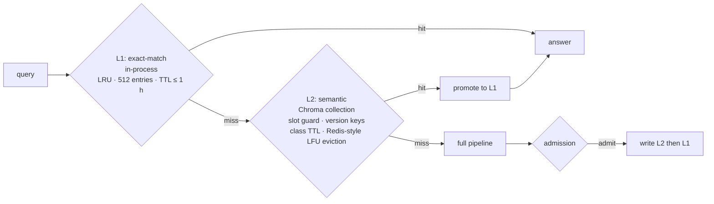
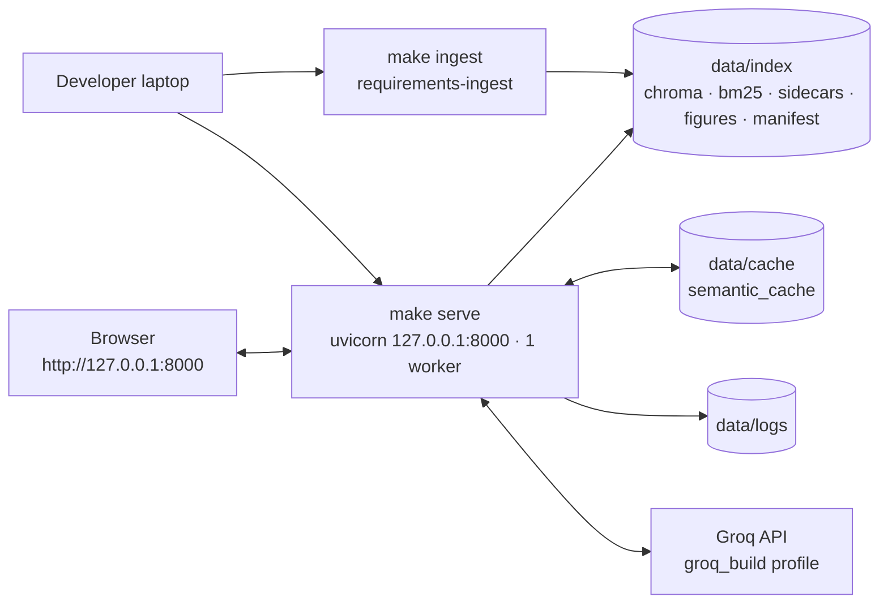

# Architecture — Advanced Multimodal RAG for Balance Sheet Analysis (NVIDIA FY2026)

| Field | Value |
|---|---|
| Document version | v0.3 (review rounds 1 and 2 incorporated) |
| Date | 17 September 2026 |
| Change log | v0.1 initial proposal · v0.2 review round 1 (hosting, budget, calculator/citations, single-turn, industry-standard cache policy, multimodal strategy) · v0.3 review round 2 (localhost-only build, Groq-only models, Kubernetes removed, online deployment deferred) |
| Companion documents | [`problemstatement.md`](./problemstatement.md) · [`implementation_plan.md`](./implementation_plan.md) |
| Citation tags | **[B1]** cache/TTL brainstorm · **[B2]** compression-classifier brainstorm · **[B3]** package reasoning · **[B4]** corpus inspection · **[B5]** query-side design · **[B6-Qn]** review round 1 · **[B7-Qn]** review round 2 · **[R-n]** external references (§17) |

## Contents
0. Review resolutions
1. Architecture principles
2. System overview
3. Ingestion pipeline
4. Query pipeline
5. Semantic cache and TTL strategy **[B1]**
6. Compression classifier **[B2]**
7. Model allocation and profiles
8. Package selection with reasoning **[B3]**
9. Data model
10. Repository layout
11. Configuration
12. Evaluation and observability
13. Failure modes and mitigations
14. Deployment (localhost now, online later)
15. Build phases
16. Decision log
17. References
18. Open questions

---

## 0. Review resolutions [B6][B7]

### 0.1 Review round 1 [B6] — with status after round 2

| # | Open question (v0.1) | Answer in round 1 | Status after round 2 |
|---|---|---|---|
| Q1 | Hosting target | Simple HTML frontend; hosting on "Render or kind" | **Revised by B7-Q1/Q3:** "kind" meant "Render or similar platforms", not Kubernetes. Kubernetes is removed. v1 runs on **localhost only**; online hosting is decided after the backend is complete (§14). |
| Q2 | Budget | Free tier now; paid Gemini/Anthropic for demo; Groq for testing | **Revised by B7-Q2:** models stay swappable, but **the whole build uses Groq only**. Anthropic/Gemini profiles are defined as inactive templates (§7). |
| Q3 | Calculator and citations | Both stay | Accepted, unchanged |
| Q4 | Conversation | Single-turn v1, multi-turn later | Accepted, unchanged |
| Q5 | Cache policy | Industry standard: Redis `volatile-lfu` for L2, LRU+TTL for L1 | Accepted, unchanged (§5.4–5.10) |
| Q6 | Multimodal strategy | Description-based retrieval + image passthrough; no image-embedding model | Accepted; rationale re-stated without hosting assumptions (§3.7) |

### 0.2 Review round 2 [B7]

| # | Question raised in v0.2 | Answer | What changed |
|---|---|---|---|
| Q1 | Does "kind" mean Kubernetes-in-Docker? | No — it meant "Render or similar platforms" | All Kubernetes design removed (manifests, PVC, pod presets). |
| Q2 | Paid API billing for demo profiles? | Keep models swappable; **use Groq only for now and during the build**; switch to advanced models later | Single active profile `groq_build`; ingestion enrichment also on Groq with cached outputs; generator bake-off deferred (§7). |
| Q3 | Render free trade-offs / demo access? | Not using Render now. **Simple localhost HTML** to test queries and caching; deployment decided after the backend is built | Deployment section rewritten for localhost (§14); memory envelope no longer a hard constraint; demo protection deferred; dev-only clock control added so TTL expiry can be tested locally; local reranker upgraded to `bge-reranker-base`. |

A phase-wise build plan now lives in [`implementation_plan.md`](./implementation_plan.md).

---

## 1. Architecture principles

| ID | Principle | Why | Source |
|---|---|---|---|
| P1 | **The cache path is LLM-free.** Normalization, slot extraction, embedding, and cache lookup use no LLM calls. | A cache that needs an LLM call to check itself saves nothing. | [B1] |
| P2 | **Small models do support work; the large model only answers.** | Brief item 6; large-model tokens dominate cost. | [B5] |
| P3 | **Numbers are sacred.** No LLM paraphrases, compresses, or calculates a financial figure. | Finance answers are judged on exact numbers; token-level compression and LLM arithmetic both corrupt digits. | [B2], [B4] |
| P4 | **Deterministic before probabilistic.** Rules and classical ML run first; LLMs only when rules are not confident. | Cheaper, testable, explainable in interviews. | [B2], [B5] |
| P5 | **Every component is gated and measured.** Reranking, compression, and expansion run only when a gate says they pay off, and each has an ablation. | "Advanced" components must prove their value on a 175-page corpus. | [B2], [B5] |
| P6 | **Provenance everywhere.** Every chunk carries section and page; every answer carries citations. | Auditability of financial claims. | [B4] |
| P7 | **Heavy ingestion, light serving.** Layout models and vision models run offline; the serving process loads a prebuilt index and has no PyTorch dependency. | Fast local iteration now; keeps later hosting choices (Render or similar) open without rewrites [B7-Q3]. | [B3], [B7-Q3] |
| P8 | **Provider-agnostic model layer.** Model IDs are configuration; Groq is the only active provider during the build. | Swap to advanced models later without code changes [B7-Q2]; free-tier model names and quotas change frequently. | [B3], [B7-Q2] |

---

## 2. System overview

Two pipelines share the ChromaDB store: an offline **ingestion pipeline** and an online **query pipeline** orchestrated as a LangGraph state machine.



---

## 3. Ingestion pipeline

### 3.1 Parsing [B3][B4]

- **Tool:** Docling standard PDF pipeline with layout analysis, reading-order detection, TableFormer table structure, and picture extraction enabled (`do_table_structure=True`, `generate_picture_images=True`).
- **Why layout-aware:** naive extraction interleaves columns on the Annual Review letter pages (p. 13 evidence) [B4].
- **Recommended pattern:** use the standard pipeline for layout and image extraction, then run vision-model enrichment as a separate step, rather than the pure VLM pipeline — the pure VLM pipeline only yields picture items if the model output references them [R-5].
- **Validation pass for financial statements:** for pages containing "Consolidated Balance Sheets", "Consolidated Statements of Income", "Consolidated Statements of Cash Flows", the table is also extracted with pdfplumber. The two parses are compared cell-by-cell; disagreements are logged and the pdfplumber parse wins for numeric cells (its text-layer extraction of p. 141 was clean during inspection) [B4].
- **Accounting identity check:** after parsing the balance sheet, assert `Total assets == Total liabilities and shareholders' equity` for both period columns (206,803 = 206,803; 111,601 = 111,601). Failure blocks ingestion.

### 3.2 Section tagging

Page ranges from inspection [B4] seed the section map; Docling headings refine it.

| `section` | PDF pages | Sub-tag examples (`subsection`) |
|---|---|---|
| `annual_review` | 1–18 | shareholder_letter, narrative_spread |
| `proxy` | 19–88 | notice_of_meeting, compensation, pay_vs_performance, proposals |
| `form_10k` | 89–174 | item_1_business, item_1a_risk_factors, item_5_market, item_7_mdna, item_8_financials, notes |
| `back_cover` | 175 | — |

### 3.3 Narrative text: structure-first semantic chunking [B5]

Pure semantic chunking over a flattened document would happily merge a heading from one section into the tail of another. The chunker therefore works in two passes.

**Pass 1 — structural blocks.** Docling elements are grouped into blocks bounded by section headings, tables, figures, and page-section changes. Tables and figures never enter the text chunker.

**Pass 2 — semantic splitting inside each block.**

```
sentences = sentencize(block)                     # spaCy rule-based sentencizer
emb = embed(sentences)                            # same embedding model as retrieval
d[i] = 1 - cos(emb[i], emb[i+1])                  # distance between neighbours
threshold = percentile(d_over_whole_corpus, 90)   # corpus-level, not per block
split where d[i] > threshold
merge pieces < MIN_TOKENS (120) into neighbour with the smaller distance
split pieces > MAX_TOKENS (450) at the largest internal distance
prepend breadcrumb: "[Form 10-K > Item 7 MD&A > Fiscal Year 2026 Summary]"
save sentence spans + sentence embeddings to sidecar files (used at serving; no spaCy in the serving image)
```

- **Why a corpus-level percentile:** per-block percentiles force splits into short, coherent blocks.
- **Why a 450-token cap:** keeps chunks within the 512-token window of `bge-small-en-v1.5` including the breadcrumb.
- **Why breadcrumbs:** embeds section context into short chunks (a "Gross margin decreased…" sentence is far more retrievable when it carries "MD&A > Fiscal Year 2026 Summary").
- **Why custom rather than `langchain_experimental.SemanticChunker`:** the same algorithm in ~60 lines, with structure awareness, corpus-level thresholds and size guards the reference implementation does not provide, and no dependency on an experimental package [B3].

### 3.4 Tables: parent table chunks + row-fact children [B4][B5]

Numbers carry almost no semantic signal for dense embeddings, so tables are indexed in two complementary forms.

**(a) Table chunk (parent)** — one per table (large tables split by row groups with the header repeated):
- `document`: breadcrumb + a one-line generated summary + the table as Markdown.
- The summary is produced by the small LLM once at ingestion, e.g., *"Consolidated balance sheet of NVIDIA comparing assets, liabilities and equity as of Jan 25, 2026 and Jan 26, 2025, in USD millions."*

**(b) Row-fact chunks (children)** — one per line item in financial statement tables:
```
document: "NVIDIA Consolidated Balance Sheets — Inventories: $21,403 million as of Jan 25, 2026 (FY2026); $10,080 million as of Jan 26, 2025 (FY2025)."
metadata: {
  modality: "row_fact", parent_id: "tbl_p141_0", statement: "balance_sheet",
  line_item: "Inventories", line_item_norm: "inventories", line_group: "current_assets",
  value_fy2026: 21403, value_fy2025: 10080, unit: "USD_millions",
  period_end_fy2026: "2026-01-25", period_end_fy2025: "2025-01-26", page: 141
}
```

- Row facts make `POINT_LOOKUP` retrieval nearly exact (BM25 on the line-item name + dense on the sentence).
- Numeric metadata feeds the deterministic calculator directly — no LLM ever parses a number out of text at query time.
- At retrieval, a hit on a row fact can be expanded to its parent table (small-to-big) when the query intent needs surrounding rows.

### 3.5 Figures: detect → rasterize → classify → describe [B4]

1. **Detect** picture regions from Docling layout, plus pages with dense vector drawing operators (to catch vector charts such as p. 123 that `pdfimages` cannot see).
2. **Rasterize** the region (or full page if the region is unreliable) at 150–200 DPI using pypdfium2; save to `data/figures/p{page}_{idx}.png`.
3. **Classify and describe** with a single vision-model call (Groq `vision` role during the build; result cached by content hash + model id, §7.3) returning JSON:
   ```json
   {"figure_type": "chart|diagram|table_image|photo|logo|decorative",
    "title": "...", "description": "...",
    "data_points": [{"series": "NVIDIA Corporation", "x": "1/25/2026", "y": 1448.75}],
    "numbers_are_approximate": true}
   ```
4. **Drop** `photo`, `logo`, `decorative` (e.g., the p. 5 data-center render).
5. **Link companion tables:** if the same page has a table whose header tokens overlap the chart's axis/series labels (p. 123 has an exact data table under the chart), set `companion_table_id`. At answer time the table's values take precedence over vision-estimated values.
6. **Index** the description as a `figure` chunk with `image_path` in metadata. The generator receives the actual image for `VISUAL` intents (§4.9).

**Why description-based ("summary-then-embed") rather than CLIP-style image embeddings:** financial charts and diagrams are retrieved by what they *mean* ("five-year total return vs Nasdaq"), which CLIP-family embeddings capture poorly for text-dense charts. Chroma does support multimodal collections with OpenCLIP [R-1]; this is kept as an optional v2 experiment for image-to-image search [B3].

### 3.6 Embedding and indexing

- All chunk documents embedded with `BAAI/bge-small-en-v1.5` (default; `bge-base-en-v1.5` is compared at the Phase 3 embedder gate, §7.5) through fastembed (ONNX runtime, 384-dim, normalized, cosine space) — the same runtime used at serving so query and document vectors are numerically consistent (§8.2). Chroma collections are created with `embedding_function=None`; vectors are passed explicitly. Documents embedded without the query instruction prefix; queries with it.
- Upserted into Chroma collection `report_chunks` (persistent client, `hnsw:space=cosine`).
- BM25 index built over the same `id → document` mapping with `rank_bm25` (BM25Okapi) and pickled beside the Chroma directory. Tokenizer keeps numbers and `$` amounts as tokens and lower-cases line items.
- **Why BM25 outside Chroma:** local Chroma reported "sparse vector indexing is not enabled in local" as of January 2026 [R-3]; Chroma's native BM25/SPLADE and `Search()`+`Rrf` API are documented for Chroma Cloud [R-2]. A `SparseRetriever` interface lets the implementation switch to native Chroma sparse search if local support lands.
- `corpus_version = sha256(pdf_bytes + ingestion_config_yaml)[:12]` stored in a manifest and in every chunk's metadata.
- Figure crops and page thumbnails for pages that contain cited figures/tables are saved as WebP inside the index artifact for the UI and visual page fallback (§3.7).

### 3.7 Multimodal retrieval strategy — decision from review round 1 [B6-Q6]

**Decision:** keep multimodal retrieval **description-based** (figures become text chunks written by a small vision model) and put vision reasoning where it matters — **at generation time, with the actual image**. No image-embedding model is added.

What this includes:
1. **Figure chunks** (§3.5): classification, description, extracted data points, and a link to any companion table.
2. **Image passthrough:** for `VISUAL` intent, the cropped figure (≤ 2 images) is sent to the large multimodal model alongside the companion table text.
3. **Visual page fallback:** if a `VISUAL` query's best figure chunk scores below the rerank floor, or has `numbers_are_approximate=true` with no companion table, the pre-rendered full page (WebP) is attached instead, so the generator sees layout, legend, and footnotes.
4. **UI thumbnails:** every citation links to its page thumbnail, and figure answers show the figure itself, so a reviewer can visually verify the claim.

**Why this over the alternatives**

| Option | Why not now |
|---|---|
| OpenCLIP image embeddings in a Chroma multimodal collection [R-1] | Adds a PyTorch vision encoder to serving (against P7) for little gain. CLIP-family embeddings also represent text-dense charts and tables poorly, and finance questions ask what a chart *means* ("5-year return vs Nasdaq 100"), which the description text already captures. |
| ColPali-style page-image late-interaction retrieval | Needs a GPU-class vision-language encoder (the build runs on a laptop CPU) and multi-vector (late-interaction) search that Chroma does not provide natively. Most of the corpus is digital text and tables where text retrieval is already strong. |
| Vision-embedding API at query time | Every query and cache lookup would spend API quota and add latency, violating P1. |
| Figure retrieval skipped entirely | Fails the brief's multimodal requirement, and the p.123 chart and p.3 diagram carry content that text extraction cannot see [B4]. |

**Why it fits this corpus specifically:** inspection showed that many of the 109 embedded images are decorative, and the meaningful visuals are few (the performance chart, the stack diagram, a handful of annual-review diagrams). A one-time small-vision-model pass over that small set costs very little. Groq's Llama 4 Scout (during the build) and the future Anthropic/Gemini generators read images natively, so the "multimodal" reasoning still happens on the real pixels.

**Revisit trigger:** if the corpus grows to many visually driven documents (investor presentations, slide decks), re-evaluate page-image retrieval on GPU-capable infrastructure.


---

## 4. Query pipeline

### 4.1 LangGraph flow



### 4.2 Node: `normalize_and_extract_slots` (rules, no LLM) [B1][B5]

Output is a `QuerySlots` Pydantic object used by the cache guard, retrieval filters, and the calculator.

| Slot | Extraction method | Examples |
|---|---|---|
| `entity` | Alias dictionary | "Nvidia", "NVDA", "the company" → `NVIDIA` |
| `fiscal_periods` | Regex + fiscal calendar table | "FY26", "fiscal 2026", "Jan 25, 2026", "end of last fiscal year" → `FY2026`; bare "2025" → `AMBIGUOUS_2025` (resolved to FY2026 with a note in the answer) |
| `metrics` | Finance glossary (≈150 entries mapping synonyms → `line_item_norm` or formula id) | "cash pile" → `cash_and_cash_equivalents` + `marketable_securities`; "liquidity ratio" → `current_ratio` |
| `statement` | Keyword map | "balance sheet" → `balance_sheet` |
| `direction` | Lexicon | increase/grow/rise vs decrease/decline/fall |
| `aggregation` | Lexicon | YoY, change, growth, ratio |
| `time_anchor` | Lexicon | "upcoming", "next", "current", "latest", "now" → flags time-anchored TTL class |

Normalization for the L1 key: lower-case, Unicode normalize, collapse whitespace, strip punctuation except `$ % .`, canonicalize period and metric synonyms. `L1_key = sha256(normalized_text + version_keys)`.

### 4.3 Node: scope gate

Rule-first detection of `OUT_OF_SCOPE` (buy/sell/hold, price targets, "right now" market data). Cheap small-LLM fallback only when the rule score is borderline. Refusals are cached only in L1 (short TTL) because refusal wording may evolve.

### 4.4 Node: `analyze_and_expand` [B5]

**Step 1 — rule-based intent.** If slots contain a single metric + single period and no explanatory verbs → `POINT_LOOKUP` with confidence ≥ 0.9; a known formula id → `COMPUTATION`; two periods or an aggregation word → `COMPARISON_TREND`; "chart/graph/diagram/figure/total return" → `VISUAL`.

**Step 2 — small LLM only when rules are not confident**, in *one* structured-output call that returns intent, expansions, and sub-questions together (one call instead of three):

```json
{
  "intent": "EXPLANATORY",
  "sub_questions": ["What drove the gross margin decrease in fiscal year 2026?"],
  "paraphrases": ["Reasons for lower gross margin FY2026 NVIDIA",
                  "gross margin decline Hopper HGX to Blackwell transition"],
  "section_hints": ["form_10k:item_7_mdna"],
  "needs_image": false
}
```

**Expansion techniques by intent**

| Intent | Glossary expansion | Decomposition | LLM paraphrases | HyDE |
|---|---|---|---|---|
| POINT_LOOKUP | ✅ | — | ❌ (skip LLM when rule-confident) | ❌ |
| COMPUTATION | ✅ | ✅ one sub-query per formula input | ❌ | ❌ |
| COMPARISON_TREND | ✅ | ✅ per period if needed | ≤1 | ❌ |
| EXPLANATORY | ✅ | optional | ≤2 | ✅ numbers-free |
| VISUAL | ✅ | — | ≤1 | ❌ |
| CROSS_SECTION | ✅ | ✅ one per section | ≤2 | ❌ |

- **Decomposition example:** "quick ratio" → formula inputs `cash_and_cash_equivalents`, `marketable_securities`, `accounts_receivable_net`, `total_current_liabilities` → four row-fact lookups (often satisfied by metadata filtering alone).
- **Numbers-free HyDE:** the hypothetical passage is generated with the instruction "describe what the relevant disclosure would discuss; do not state any figures". A hallucinated number inside a HyDE document would pull retrieval toward chunks containing that wrong number.
- **Cap:** at most 4 retrieval queries per user query, keeping retrieval latency and reranker load bounded.

### 4.5 Node: `hybrid_retrieve` [B5]

For each retrieval query:
1. **Metadata pre-filter** from slots: e.g., `statement="balance_sheet"` and `modality in ["row_fact","table"]` for balance-sheet lookups; section hints for explanatory queries. If a filtered search returns fewer than 3 results, retry unfiltered (filters are hints, not walls).
2. **Dense:** Chroma query, top 30.
3. **Sparse:** BM25, top 30.
4. **Fuse:** Reciprocal Rank Fusion, `score = Σ 1/(k + rank)`, `k = 60`, across all retrieval queries and both retrievers. RRF uses ranks only, so BM25's unbounded scores and cosine similarities need no normalization [R-4].
5. **Small-to-big:** row-fact hits pull their parent table id into the candidate set when intent ∈ {COMPARISON_TREND, EXPLANATORY}; figure hits pull their `companion_table_id`.

### 4.6 Node: rerank gate and reranker [B5]

The reranker is a local ONNX cross-encoder, `BAAI/bge-reranker-base` via fastembed (§7.5) — a small model per brief item 6, with zero API cost. `Xenova/ms-marco-MiniLM-L-6-v2` is kept in config as a lightweight alternative for a future constrained host.

**Skip reranking when any is true:**
- S1: intent = `POINT_LOOKUP`/`COMPUTATION` **and** every required metric has an exact `line_item_norm` metadata match in the top 5 fused results.
- S2: a single retrieval query was used **and** fused candidates ≤ `final_k` (8).
- S3: top-1 fused result appears at rank 1 in both dense and BM25 lists **and** its RRF score exceeds the second result by ≥ 30%.

**Otherwise:** rerank the top 30 fused candidates with (original user query, chunk) pairs → keep top 8, with a floor: drop candidates whose rerank logit is below a calibrated threshold, but always keep ≥ 3.

Reranking always uses the *original* query (not paraphrases) so expansion improves recall without diluting precision.

### 4.7 Node: compression classifier → see §6 [B2]

### 4.8 Node: compressors [B2]

| Action | Method | LLM? | Applies to |
|---|---|---|---|
| `DEDUPE` | Pairwise cosine on chunk embeddings ≥ 0.95 (embeddings already computed) → keep the chunk with the higher rerank score, record merged citations | No | Any modality |
| `ROW_SELECT` | Keep header + rows whose `line_item_norm` ∈ query metrics + the section total rows; keep full table if intent = EXPLANATORY | No | Table chunks |
| `EXTRACT_LIGHT` | Keep sentences with cosine(query or expansions) ≥ τ plus one neighbour sentence each side | No (embeddings only) | Narrative chunks, moderate noise |
| `EXTRACT_LLM` | Small LLM: "copy verbatim the sentences needed to answer; do not rewrite, do not summarize numbers" | Small LLM | Long narrative chunks with low relevance density |
| `DROP` | Remove | No | Below rerank floor |

**Numeric fidelity guard (all LLM-compressed output):** extract every number token from the compressed text; each must appear verbatim in the source chunk. Any violation → discard the compressed version and use the original chunk; log the violation (NFR-6).

### 4.9 Node: `assemble_context`

- Order: row facts and tables first, then narrative, then figures; within each group by rerank score.
- Each block is wrapped with a citation header: `[C3 | Form 10-K › Consolidated Balance Sheets | PDF p.141 | table]`.
- For `VISUAL` intent (or analyzer `needs_image=true`), attach the figure PNG(s) as image parts to the large-model request (max 2 images), plus the companion table text.
- Token budget for the large model context is set by `MODEL_PROFILE` (§7.2): 2,500 tokens on `groq_build` (free-tier tokens-per-minute limits), 6,000 tokens on the future Anthropic/Gemini profiles.

### 4.10 Node: `calculator` (deterministic) [B4]

- **Formula registry** (`formulas.yaml`): `current_ratio`, `quick_ratio`, `working_capital`, `debt_to_equity`, `liabilities_to_equity`, `equity_ratio`, `yoy_change_pct`, `yoy_change_abs`, `cash_and_investments`.
- Inputs are read from row-fact metadata (`value_fy2026`, `value_fy2025`), never from generated text.
- Output is a `CalculationResult` with formula, inputs (with chunk ids and pages), result, and rounding rule — injected into the prompt as a pre-computed fact block the model must use verbatim.
- Missing inputs → the result says which line item was not found; the model is instructed to say so rather than estimate.

### 4.11 Node: `generate` (large model)

Prompt contract:
- Answer only from the provided context blocks and calculation results.
- State unit (USD millions unless stated) and fiscal period with period-end date for every figure.
- Cite block ids inline; the app maps ids to "Form 10-K, PDF p.141".
- If the user said a bare year, state the fiscal-year interpretation used.
- If context is insufficient, say what is missing — no outside knowledge.
- Structured output: `{answer_markdown, figures_used:[{value, unit, period, citation}], citations:[...], confidence: high|medium|low, answer_class: filed_fact|analytical|time_anchored}`.

### 4.12 Node: `verify_answer`

Cheap deterministic checks, no LLM:
1. Every number in `answer_markdown` (after unit normalization) matches a value in cited context or a `CalculationResult`, or is a year/date.
2. Every citation id exists in the assembled context.
3. Period in `figures_used` is consistent with slots.

Failing check → one regeneration attempt with the failure message appended; second failure → return with `confidence=low` and a visible warning, and do **not** admit to cache.

### 4.13 Node: cache admission and write → see §5.6 [B1]

---

## 5. Semantic cache and TTL strategy [B1]

### 5.1 First, a terminology correction that shapes the design

The brief lists eight "TTL strategies". Only one of them — **Time To Live** — is actually a TTL strategy. The rest are **eviction policies**. They answer different questions and are not alternatives to each other:

| Mechanism | Question it answers | Trigger |
|---|---|---|
| **Expiry (TTL)** | *Is this entry still trustworthy?* | Age of the entry |
| **Eviction (LRU, LFU, FIFO, MRU, RR…)** | *The cache is full — which entry goes?* | Capacity pressure |
| **Invalidation** | *Did something change that makes this entry wrong right now?* | Corpus / prompt / model change |
| **Admission** | *Should this answer enter the cache at all?* | Answer quality |
| **Tiering** | *Where does this entry live?* | Cost/speed of storage |

A production semantic cache needs all five. The brainstorm question therefore becomes: **which combination fits a financial-report RAG?**

### 5.2 Workload characteristics that drive the choice

| # | Characteristic | Implication |
|---|---|---|
| W1 | The corpus is static between filings (annual 10-K; amendments rare). | Wall-clock staleness of *filed facts* is low; **version invalidation** matters more than short TTLs. |
| W2 | Answers also depend on prompt, model, and retrieval config — providers can silently change what a model alias points to. | Version keys + a **TTL safety ceiling** even for static facts. |
| W3 | Query popularity is skewed: a head of canonical questions (total assets, current ratio, cash, debt, inventory, gross margin) and a long tail of one-offs. | **Frequency** is a strong signal of future reuse. |
| W4 | Demand is bursty and seasonal (earnings releases, the annual meeting, news about export controls). | Burst queries temporarily look "frequent" — pure frequency counting gets polluted. |
| W5 | Some content is time-anchored: the annual meeting on June 24, 2026 is already past as of Sept 2026. An answer cached in May saying "the upcoming meeting is June 24" is now misleading. | **Class-based TTLs**, not one global TTL. |
| W6 | A semantic false hit is costly (wrong period → wrong number). | Cache precision beats cache hit rate; **admission** and **slot guards** are mandatory. |
| W7 | Two very different lookup costs: exact-string match (microseconds) vs embedding + ANN (~10–50 ms). | **Two tiers**. |

### 5.3 Evaluation of the eight options

Ratings: ●●● strong fit · ●● partial · ● weak · ✗ unsuitable.

| Option | How it decides | Strength for this workload | Weakness for this workload | Fit |
|---|---|---|---|---|
| **(a) LRU** — Least Recently Used | Evict the entry unused for longest | Handles bursts (W4) naturally; O(1); simple | A wave of one-off long-tail queries pushes out canonical head questions that simply weren't asked in the last hour (W3) | ●● |
| **(b) LFU** — Least Frequently Used | Evict the entry with the fewest hits | Protects the canonical head (W3) | *Frequency inertia*: entries that were hot during a past burst keep high counts and block newly popular queries (W4); newcomers start at count 1 and are evicted first | ●● (●●● with aging) |
| **(c) MRU** — Most Recently Used | Evict the entry used most recently | Only suits workloads where a just-used item is unlikely to be used again (e.g., sequential scans) | Directly contradicts W3/W4: the question just asked is the most likely to be asked again | ✗ |
| **(d) TTL** — Time To Live | Expire entries after a fixed age | Bounds staleness (W2, W5); easy to reason about | Not an eviction policy — does nothing about capacity; one global TTL is either too short for filed facts or too long for time-anchored answers | ●●● as the *expiry* layer (class-based) |
| **(e) FIFO** — First In, First Out | Evict the oldest inserted entry | Trivial; predictable | Ignores popularity; canonical questions are usually cached first, so the most valuable entries are the first evicted | ● |
| **(f) Two-tier caching** | Small fast tier in front of a larger slower tier | Matches W7: exact-match hot tier avoids embedding cost; semantic tier catches paraphrases; each tier gets its own policy | More moving parts; needs consistent invalidation across tiers | ●●● as the *structure* |
| **(g) Random Replacement** | Evict a random entry | Zero bookkeeping; a useful lower bound in benchmarks | Uses no signal; evicts canonical entries as readily as junk | ✗ (benchmark control only) |
| **(h) Less frequently used data** (cold-data demotion / LFU-with-aging) | Demote or evict entries whose *recent* usage is low | Fixes LFU's inertia: frequency that decays with time captures W3 and W4 together | Needs a decay parameter to tune | ●●● as the *eviction* rule |

### 5.4 Decision — revised in review round 1 [B6-Q5]: adopt an industry-standard policy

v0.1 proposed a custom decaying-frequency formula with an invented 7-day half-life. Review round 1 asked for an industry-standard policy with reasons. The revised decision:

> **L2 (semantic tier) follows Redis `volatile-lfu` semantics:** every entry carries a TTL, and when capacity is reached the entry with the lowest *approximated, decaying* access frequency is evicted. Redis implements LFU with a probabilistic Morris counter plus a decay period, specifically so frequency counts fade and the cache adapts when access patterns shift [R-12].
>
> **L1 (exact tier) follows the standard in-process LRU + TTL** (`cachetools.TTLCache`).
>
> **TTL values follow the commonly used 1–30 day range by content volatility, combined with versioned cache keys and a manual purge endpoint** [R-17].
>
> The two-tier structure, TTL classes, version invalidation, admission policy, and slot guard from [B1] are unchanged; only the eviction algorithm and TTL values moved to standards.

**Why adopt a standard instead of the v0.1 custom formula**

1. **Known behaviour and defaults.** Redis LFU is widely deployed and documented. The custom formula had a free parameter (half-life) with no traffic data to tune it.
2. **Nothing from the brainstorm is lost.** [B1] concluded that "frequency with aging" fits a skewed, bursty workload (W3 + W4). Redis LFU *is* frequency with aging.
3. **Interview defensibility.** "Redis `volatile-lfu` semantics, ported to a Chroma-backed semantic cache" is instantly recognisable to reviewers.
4. **Scale-out path keeps identical semantics.** If L2 later moves to Redis/RedisVL [R-7], setting `maxmemory-policy volatile-lfu` preserves eviction behaviour, so benchmark conclusions still hold.

**Why this standard over the other standard policies**

| Standard alternative | Where it is the norm | Why not chosen for L2 |
|---|---|---|
| `allkeys-lru` / `volatile-lru` | The classic cache default; still widely recommended for pure caches [R-12] | Recency-only. A wave of one-off long-tail questions evicts canonical, repeatedly asked questions (W3). Redis added LFU precisely to protect genuinely hot keys regardless of when they were last touched. **Kept as the main benchmark challenger.** |
| `volatile-ttl` | Mixed stores where soon-to-expire data is cheapest to lose | Uses no popularity signal. Within a TTL class it degenerates to FIFO. **Used only as the tie-breaker.** |
| `allkeys-random` / `volatile-random` | Uniform-access workloads | No signal at all; benchmark control only. |
| `noeviction` | Redis used as a primary datastore | Writes fail when full — wrong for a cache. |
| FIFO | Simple queues and buffers | Ignores popularity. Canonical questions are cached first, so they would be evicted first. |
| MRU | Niche sequential-scan workloads | Opposite of this access pattern. |
| TTL-only, no capacity bound | Common default when using a semantic cache library with just a `ttl` parameter | Unbounded growth: no capacity guarantee as the corpus, traffic, or number of companies grows. |

**Why `volatile-` rather than `allkeys-`:** the admission policy (§5.6) guarantees every entry has a TTL, so the two behave identically. `volatile-` states the invariant explicitly: no cache entry is immortal.

**Why LFU rather than LRU, when Redis guidance treats both as valid for pure caches:** two workload facts tip the balance. Query popularity is heavily skewed toward a canonical head (W3), and a miss is expensive — a full retrieval-plus-large-model pipeline run (W6). LFU's hit-ratio advantage on skewed traffic is the one that matters here. The benchmark (§5.10) must confirm this. If LRU wins on correct-hit rate, the decision flips (promotion rule in §5.10).



**Why LRU is right for L1 but not for L2:** L1 is tiny, process-local, and exists to absorb bursts (repeated clicks, the same demo question, a page reload). Every L1 entry also exists in L2, so an L1 eviction costs one embedding plus an ANN lookup, never an LLM call. L2 is where a wrong eviction costs a full pipeline run, so it uses the richer frequency signal.

### 5.5 TTL classes (expiry layer) — revised [B6-Q5]

Values now sit inside the commonly used 1–30 day range for LLM response caches, set by content volatility [R-17]. `answer_class` comes from the generator's structured output, overridden by rules (any `time_anchor` slot forces `time_anchored`).

| TTL class | Assigned when | TTL | Rationale |
|---|---|---|---|
| `filed_fact` | Numbers and facts from financial statements / 10-K; POINT_LOOKUP, COMPUTATION, COMPARISON_TREND | **30 days** (top of range) | Corpus is static (W1). Version keys do the real invalidation; TTL is the safety ceiling for invisible drift such as model-alias changes (W2). |
| `analytical` | EXPLANATORY, CROSS_SECTION, VISUAL interpretations | **7 days** | More sensitive to prompt/model improvements; weekly refresh lets improvements reach users. |
| `time_anchored` | "upcoming/next/current/latest", meeting dates, deadlines, outlook statements | **1 day, or until the referenced event date if that is sooner** (events already in the past get the plain 1-day TTL) | Truth depends on wall-clock time (W5). |
| `negative` | "Not found in the report" answers | **1 day** (bottom of range) | May be retrieval misses that a later fix resolves. |
| `low_confidence` / failed verification | `confidence=low` or verifier failure | **Not cached** | Protects cache precision (W6). |
| L1 exact tier | All admitted entries | **min(class TTL, 1 hour)** | Bounds divergence from L2 after an invalidation. |

**Lazy + active expiry:** every lookup filters on `expires_at` (lazy); a sweeper deletes expired L2 records every 15 minutes and on app start (active) — the same two-pronged approach Redis uses for key expiry.

**Localhost note [B7-Q3]:** L2 persists on local disk (`data/cache/`) across server restarts, so TTL expiry, LFU counters, and the sweeper are all observable locally. In dev mode a single injectable clock (`clock.now()`, adjustable from the UI) lets 1-, 7-, and 30-day expiry be tested in seconds (§14, implementation plan Phase 6). Whether a future online host keeps a persistent disk is a deployment-time decision.

### 5.6 Admission policy

An answer is written to cache only if **all** hold:
1. `verify_answer` passed (numbers traceable, citations valid).
2. `confidence ∈ {high, medium}`.
3. Intent ≠ `OUT_OF_SCOPE` (refusals go to L1 only).
4. The query is self-contained. v1 is single-turn by decision [B6-Q4]; this rule becomes the multi-turn hook in v2 (§15).
5. The response contains at least one citation.

### 5.7 Invalidation via version keys

Every L2 record stores `corpus_version`, `prompt_version`, `generator_model`, `retrieval_config_hash`, `calculator_version`. Lookups apply equality filters on all five in the Chroma `where` clause, so stale-version entries never match. The sweeper deletes non-matching versions asynchronously. A manual `POST /api/admin/cache/purge` endpoint (scope: all | class | slot) exists for emergencies.

Because `generator_model` is a version key, answers generated during the Groq build can **never** be served after switching to Anthropic or Gemini models, and vice versa [B7-Q2].

### 5.8 Semantic lookup with slot guard (the false-hit defence)

Plain cosine similarity cannot reliably distinguish "total assets FY2026" from "total assets FY2025", or "increase" from "decrease". The guard makes structured slots a **hard filter** and similarity a **soft score**.

```python
def l2_lookup(query_emb, slots, versions, now):
    where = {
        "$and": [
            {"corpus_version": versions.corpus},
            {"prompt_version": versions.prompt},
            {"generator_model": versions.generator},
            {"retrieval_config_hash": versions.retrieval},
            {"calculator_version": versions.calculator},
            {"entity": slots.entity},
            {"periods_key": slots.periods_key},  # e.g. "FY2026" or "FY2025|FY2026"
            {"metrics_key": slots.metrics_key},  # sorted canonical metric ids, "" if none
            {"direction": slots.direction or "none"},
            {"expires_at": {"$gt": now}},
        ]
    }
    res = cache_collection.query(query_embeddings=[query_emb], n_results=3, where=where)
    for doc_id, dist in zip(res["ids"][0], res["distances"][0]):
        sim = 1 - dist
        if sim >= threshold_for(slots):  # see thresholds below
            on_hit(doc_id, now)  # Redis-style LFU counter update (§5.9)
            return load_answer(doc_id)
    return None
```

**Thresholds — also aligned to a standard [B6-Q5]:**
- Slot-rich queries (metric + period present): **similarity ≥ 0.90**, equal to RedisVL `SemanticCache`'s default `distance_threshold=0.1` in cosine-distance units [R-7]. The hard slot filters already carry most of the precision, so the library default is a sound starting point.
- Slot-poor queries (EXPLANATORY, no metric or period): **similarity ≥ 0.95** — stricter than the default, because similarity must do all the work.

Both are calibrated on the adversarial set before release (§5.10). BGE similarity scores cluster toward the high end, so the right absolute value is model-specific.

### 5.9 Eviction: Redis-style approximated LFU (L2)

Capacity: `L2_MAX_ENTRIES = 5,000` (configurable). The algorithm follows Redis's documented LFU design — a logarithmic Morris counter with time decay [R-12]. Constants below reflect `redis.conf` defaults as understood at design time and must be re-verified against current Redis documentation during implementation.

```python
LFU_INIT_VAL = 5  # new entries start above zero so they are not evicted immediately
LFU_LOG_FACTOR = 10  # Redis default: ~100 hits → counter ≈ 10; ~1,000 hits → ≈ 18
LFU_DECAY_TIME = (
    1440  # minutes. Redis default is 1 (tuned for high-QPS servers); scaled — see below
)


def decayed(entry, now):
    periods = (now - entry.last_decay_at) // (LFU_DECAY_TIME * 60)
    return max(entry.lfu_counter - periods, 0)


def on_hit(entry, now):
    c = decayed(entry, now)
    base = max(c - LFU_INIT_VAL, 0)
    if random.random() < 1.0 / (base * LFU_LOG_FACTOR + 1):  # logarithmic increment
        c = min(c + 1, 255)
    entry.lfu_counter, entry.last_decay_at, entry.last_hit_at = c, now, now
    entry.hit_count += 1  # analytics only


def make_room(now):
    delete_expired_and_version_mismatched()
    while count() > L2_MAX_ENTRIES:
        victim = min(
            entries(), key=lambda e: (decayed(e, now), e.expires_at)
        )  # tie → soonest expiry
        delete(victim)
```

**Differences from Redis, and why they are safe:**
- Redis *samples* a handful of keys to approximate the minimum; with ≤ 5,000 entries this cache evaluates all of them. That makes it an exact version of the same policy, not a different policy.
- Decay time is scaled from 1 minute to 1 day. Redis's default assumes thousands of accesses per minute; at portfolio/demo traffic (tens to hundreds of queries per day) a 1-minute decay would zero every counter between visits, degrading the policy to near-random. With a 1-day decay and log factor 10, a burst of about a thousand hits (counter ≈ 18) loses its advantage in roughly two weeks — matching the news/earnings-cycle burst scale in W4. Redis documents both knobs as workload-tunable.

**Honest note (unchanged from v0.1):** for one company's annual report at demo traffic, L2 will rarely reach 5,000 entries. TTL classes, version invalidation, and the slot guard do most of the real work in v1. Eviction becomes decisive with multi-company corpora or real traffic. The benchmark exists so this is measured, not assumed.

### 5.10 Cache-policy benchmark (deliverable)

- **Synthetic query log:** 5,000 queries from ~300 question templates × paraphrases × periods; popularity sampled from a Zipf distribution (s ≈ 1.1); three injected bursts (e.g., "H20 / export controls", "annual meeting"); ~20% one-off long-tail queries. Replayed against a simulated clock so a month of traffic runs in seconds.
- **Policies compared at equal capacity (100 / 500 / 1,000 entries):**
  - **Chosen standard:** Redis-style LFU with TTL.
  - **Primary challenger:** LRU + TTL.
  - **Other challengers:** LFU without decay, `volatile-ttl`, FIFO, MRU, Random, TTL-only.
  - **Implementation:** `cachetools` where available, ~20-line classes otherwise, all behind one interface.
- **Metrics:** hit rate, *correct* hit rate (slot-consistent), stale-hit rate (served past class TTL), large-model calls avoided, estimated cost saved per model profile.
- **Promotion rule:** the chosen standard stays unless a challenger beats its correct-hit rate by **≥ 5 percentage points at two or more capacities**. Otherwise the simpler-to-explain standard wins ties.
- **Threshold calibration:** adversarial pairs (period swap, metric swap, direction swap, negation) and paraphrase pairs. Choose thresholds that keep false-hit rate ≤ 1% (NFR-3) while maximising paraphrase hit rate.

### 5.11 Cache record schema (Chroma collection `semantic_cache`)

| Field | Type | Notes |
|---|---|---|
| `id` | str | `sha256(normalized_query + versions)` |
| embedding | vector | query embedding (same model as retrieval) |
| `document` | str | normalized query text |
| `answer_json` | str (metadata) | serialized structured answer |
| `entity`, `periods_key`, `metrics_key`, `direction`, `intent` | str | slot guard fields |
| `answer_class` | str | TTL class |
| `created_at`, `expires_at`, `last_hit_at`, `last_decay_at` | int (epoch s) | numeric range filters, decay |
| `lfu_counter` | int (0–255) | Redis-style LFU eviction signal |
| `hit_count` | int | analytics only (raw hits) |
| `corpus_version`, `prompt_version`, `generator_model`, `retrieval_config_hash`, `calculator_version` | str | invalidation |
| `tokens_saved_est` | int | cost reporting |

**Why the cache lives in Chroma rather than Redis/GPTCache for v1:**
- One datastore to deploy.
- Metadata filters express the slot guard and version keys directly.
- The embedding model is already loaded for retrieval.
- A separate Redis process would be one more service to run locally, for no v1 benefit.

RedisVL's `SemanticCache` [R-7] remains the documented scale-out path, and adopting Redis LFU semantics now keeps that migration behaviour-preserving [B3].

---

## 6. Compression classifier [B2]

### 6.1 What the classifier must decide

Two decisions, made after reranking and before any compressor runs:

1. **Query level:** *Does this retrieval need compression at all?* If not → skip every compressor (zero added cost and latency).
2. **Chunk level:** *If yes, which action per chunk?* → `KEEP`, `DEDUPE`, `ROW_SELECT`, `EXTRACT_LIGHT`, `EXTRACT_LLM`, `DROP`.

A binary "compress / don't compress" is too coarse for this corpus: a single retrieval routinely mixes a balance-sheet table (must never be LLM-compressed), a duplicated risk-factor paragraph (needs dedupe, not an LLM), and a long MD&A passage with one relevant sentence (benefits from extraction).

### 6.2 Design constraints

| # | Constraint | Reason |
|---|---|---|
| K1 | The classifier makes **no LLM call**. | Deciding must cost far less than compressing; otherwise the gate spends what it saves. |
| K2 | Tables, row facts, and figure data are **protected** from LLM compression. | Principle P3 — digits must survive. |
| K3 | Compression must pay for itself in money, quota, *or* answer quality. | Otherwise it only adds latency. |
| K4 | Decisions are explainable and logged. | Debug panel + training data for the learned classifier. |

### 6.3 Features (all cheap)

| Feature | Level | How computed | Signal |
|---|---|---|---|
| `total_tokens` | query | tiktoken estimate over candidate chunks | Volume |
| `budget_ratio` | query | `total_tokens / context_budget` | Pressure on the large model's context |
| `intent` | query | analyzer output | Point lookups need a tiny span; explanations need breadth |
| `n_chunks` | query | count after rerank | |
| `modality` | chunk | metadata | Protected types |
| `chunk_tokens` | chunk | tiktoken | Long chunks have more room for noise |
| `rerank_score` | chunk | cross-encoder logit (or RRF score if rerank skipped) | Relevance |
| `relevance_density` | chunk | fraction of sentences with cosine(sentence, query ∪ expansions) ≥ τ_s (sentence embeddings precomputed at ingestion) | Low density ⇒ mostly irrelevant text |
| `max_dup_sim` | chunk | max cosine to any higher-ranked chunk | Redundancy (the 5× H20 disclosure) |
| `numeric_density` | chunk | number tokens / total tokens | Numeric-heavy narrative is risky to compress |

### 6.4 Stage A — hard rules (evaluated in order)

```
R0  if intent == OUT_OF_SCOPE:                      no retrieval, no compression
R1  chunk with max_dup_sim >= 0.95:                 action = DEDUPE            (no LLM)
R2  chunk with rerank_score < DROP_FLOOR
        and rank > MIN_KEEP (3):                    action = DROP
R3  modality in {row_fact, figure}:                 action = KEEP              (protected)
R4  modality == table:
        if intent in {POINT_LOOKUP, COMPUTATION}
           and table_rows > 12:                     action = ROW_SELECT        (no LLM)
        else:                                       action = KEEP
R5  if remaining narrative tokens <= SKIP_BUDGET (1,500)
        or budget_ratio <= 0.5:                     remaining narrative = KEEP
                                                    → query-level: no LLM compression needed
R6  narrative chunk with numeric_density > 0.15:    cap action at EXTRACT_LIGHT (never EXTRACT_LLM)
```

### 6.5 Stage B — scored decision for remaining narrative chunks

```
noise           = 1 - relevance_density
budget_pressure = clip((budget_ratio - 0.5) / 0.5, 0, 1)
intent_weight   = {POINT_LOOKUP: 1.0, COMPUTATION: 1.0, COMPARISON_TREND: 0.7,
                   VISUAL: 0.5, CROSS_SECTION: 0.4, EXPLANATORY: 0.2}[intent]

score = 0.45*noise + 0.25*min(chunk_tokens/400, 1) + 0.20*budget_pressure + 0.10*intent_weight

score <  0.35                                          → KEEP
0.35 ≤ score < 0.60                                    → EXTRACT_LIGHT (embedding sentence selection)
score ≥ 0.60 and chunk_tokens ≥ 250 and break_even()   → EXTRACT_LLM
otherwise                                              → EXTRACT_LIGHT
```

`query_needs_compression = any(action != KEEP for chunk in chunks)`. Weights are hand-set starting values; Stage C replaces them.

### 6.6 Break-even test for `EXTRACT_LLM` (K3)

Let `T` = tokens sent to the compressor (chunk + ~150 prompt tokens), `ρ` = expected reduction fraction, `p_S` / `p_L` = small / large input price per token, `p_So` = small output price, and `r = p_L / p_S`.

```
Saving on the large model:  p_L × ρ × T_chunk
Cost of compressing:        p_S × T  +  p_So × (1 − ρ) × T_chunk

Compress iff  p_L × ρ × T_chunk  >  p_S × T + p_So × (1 − ρ) × T_chunk
```

Intuition: if the large model's input price is ~5× the small model's, a chunk must shrink by well over 20% before compression saves money at all — and small-model *output* tokens push the bar higher. On free tiers where money is not the constraint, the same test is applied to **requests-per-day quota** and **latency**: `break_even()` returns true only if expected reduction ≥ `MIN_REDUCTION` (default 40%) and narrative tokens exceed `SKIP_BUDGET`. `ρ` starts as `0.8 × noise` and is replaced by the running mean observed in logs.

### 6.7 Stage C — learned classifier (phase 2)

- **Labels:** for each dev/golden query, run the pipeline with compression forced on and off per chunk group; label a decision *positive* if answer correctness is unchanged or better **and** tokens saved ≥ 30%.
- **Model:** scikit-learn `LogisticRegression` (interpretable coefficients for the README), compared against `GradientBoostingClassifier` — **offline only**. The chosen logistic model's weights are exported to `classifier_weights.json` and scored at serving with NumPy (`sigmoid(w·x + b)`), keeping the serving dependency set lean (P7). If gradient boosting wins by a wide margin, serving it is revisited at deployment time.
- **Guardrails stay:** Stage A rules R1–R4 and R6 remain hard overrides; the learned model replaces only Stage B's weights.
- **Target:** precision of "compress" ≥ 0.85 — a wrong compression can lose the answer; a missed compression only costs tokens.

### 6.8 Output and logging

```json
{
  "query_needs_compression": true,
  "chunks": [
    {"id": "tbl_p141_0", "action": "ROW_SELECT",  "reason": "R4: ~35-row table, intent COMPUTATION → header + current assets/liabilities rows"},
    {"id": "txt_p96_3",  "action": "DEDUPE",      "reason": "R1: dup of txt_p105_2 (0.97)"},
    {"id": "txt_p129_1", "action": "EXTRACT_LLM", "reason": "score 0.71, density 0.18, 520 tok, break_even ok"}
  ],
  "tokens_before": 7420,
  "tokens_after_est": 3150
}
```

### 6.9 Ablation (deliverable)

Three arms on the golden set: `never_compress`, `always_compress` (every narrative chunk through EXTRACT_LLM; tables still protected), `classifier_gated`. Report accuracy, faithfulness, large-model input tokens, small-model calls, p50/p95 latency, and numeric-fidelity violations.

### 6.10 Why not LLMLingua-2 or a pure LLM compressor [B3]

Token-level pruning methods remove individual tokens by predicted importance. On financial text the tokens most at risk are exactly the ones that matter — digits, units, period qualifiers ("as of Jan 25, 2026"). Verbatim sentence selection keeps sentences whole, which makes the numeric-fidelity guard (§4.8) easy to enforce. LLMLingua-2 remains a phase-2 experiment for long, number-free narrative (e.g., Annual Review letter pages), evaluated in the same ablation harness.

---

## 7. Model allocation and profiles [B5][B6-Q2][B7-Q2]

### 7.1 Swappable by design, Groq-only during the build

One setting, `MODEL_PROFILE` in `.env`, selects the models. **During the entire build only `groq_build` is active** [B7-Q2]. Profiles for Anthropic and Gemini exist in `config/models.yaml` as templates that pass schema validation but are never called until they are switched on after the backend is complete.

**What makes a later swap a configuration change rather than a rewrite:**

| Mechanism | Effect |
|---|---|
| Role-based model lookup (`small`, `large`, `vision`) in `llm.py` | Graph nodes ask for a role, never a provider or a model name |
| Three client methods: `text()`, `json(schema)`, `vision_json(schema, images)` | Provider differences (JSON mode vs native structured output, image message formats) stay inside `llm.py` |
| Provider SDKs imported lazily | Only the active profile's package must be installed |
| `generator_model` is a cache version key (§5.7) | Answers produced on Groq are never served after switching models, and vice versa |
| Profile-level `context_budget_tokens`, price table, and rate limits | Compression break-even (§6.6), budgets, and pacing adjust automatically |
| Golden-set rerun + recalibration checklist | Defined as future step F1 in the implementation plan |

### 7.2 Active profile: `groq_build`

**Revised in Phase 0 (D-50).** The v0.3 model ids were checked against the Groq console on 2026-09-17: `llama-3.1-8b-instant` and `llama-3.3-70b-versatile` were shut down for free/developer tiers on 2026-08-16, and `meta-llama/llama-4-scout-17b-16e-instruct` was retired on 2026-07-17. The profile now uses the replacements Groq recommends on its deprecations page.

| Role | Model | Used for | Why |
|---|---|---|---|
| `small` | `openai/gpt-oss-20b` (was `llama-3.1-8b-instant`) | Query analysis + expansion, `EXTRACT_LLM` compression, scope-gate fallback, table one-line summaries at ingestion | Smallest general model still on the free tier; Groq's named replacement for the 8B Llama. `reasoning_effort: low` and `reasoning_format: hidden` keep outputs short. |
| `large` | `openai/gpt-oss-120b` (was `llama-3.3-70b-versatile`) | Answer generation for text intents | Groq's named replacement for the 70B Llama. The Phase 3 generator check now compares it against `qwen/qwen3.6-27b` (the other recommended replacement). |
| `vision` | `qwen/qwen3.8-27b` (was `llama-4-scout`) | `VISUAL` answer generation with images; figure classification and description at ingestion | One of the two vision-capable models on Groq; supports JSON mode; max 3 images per request, 2,048 tokens per image. Using it for ingestion remains a documented exception to "small models for support work", because there is no smaller vision option on Groq. |

Free-plan limits recorded in `models.yaml` `pacing` for all three: 30 RPM, 1,000 RPD, 8,000 TPM, 200,000 TPD (per organisation, per model). The 8K TPM ceiling is why the 2,500-token context budget stays.

**Profile settings**

| Setting | Value | Why |
|---|---|---|
| `context_budget_tokens` | **2,500** | Groq's free tier is limited to roughly 30 requests per minute, with low tokens-per-minute ceilings shared across models [R-15]. A generation request must fit comfortably under the per-minute token ceiling. |
| `structured_output` | JSON mode + Pydantic validation + one retry | Strict schema-constrained outputs are only available on some Groq models [R-18]. |
| `pacing` | Client-side token bucket for requests and tokens per minute, values from config | Avoids 429 storms during ingestion and evaluation runs. Exact limits are read from the Groq console at build time. |

**Side effect worth keeping:** the small context budget makes `budget_ratio` high on many queries, so the compression classifier (§6) is exercised heavily during the build.

### 7.3 Ingestion enrichment on Groq (revised in round 2)

v0.2 proposed a paid small vision model for ingestion. With a Groq-only build [B7-Q2]:

- **Figure descriptions** use `vision`; **table summaries** use `small`.
- Every enrichment result is cached at `data/parsed/enrichment/{sha256(content)}__{model_id}.json`.
  - Re-running ingestion costs zero API calls.
  - If the Scout preview is withdrawn, the existing index and cached descriptions survive; only a fresh enrichment would need another model.
- Enrichment model ids are part of the ingestion config hash, so switching enrichment models later changes `corpus_version` and **automatically invalidates the semantic cache**.
- **At the model switch (future F1),** re-enrichment with a stronger vision model is optional and done with one command, followed by the retrieval evaluation.

### 7.4 Future profiles (defined, inactive)

| Role | `anthropic` (template) | `gemini` (template) |
|---|---|---|
| `small` | `claude-haiku-4-5-20251001` | Gemini Flash-Lite class (id verified at switch time) |
| `large` | `claude-sonnet-5` (bake-off alternative `claude-opus-5`) | Gemini Pro class (id verified at switch time) |
| `vision` | same as `large` | same as `large` |
| `context_budget_tokens` | 6,000 | 6,000 |
| `structured_output` | native | native |

- **Activation needs API billing** (Anthropic Console, Gemini API paid tier); consumer chat subscriptions do not include API usage.
- **Default generator.** When the switch happens, the default is chosen by the golden-set bake-off (§12).

### 7.5 Local models (no API quota)

| Role | Model | Why |
|---|---|---|
| Embeddings (documents, queries, cache) | `BAAI/bge-small-en-v1.5` via fastembed (ONNX, 384-dim) — **default until the Phase 3 embedder gate** | Fast CPU embedding during frequent re-ingestion; low memory. |
| Embedder challenger | `BAAI/bge-base-en-v1.5` via fastembed (768-dim) | Compared on recall@8 and MRR at the end of Phase 3. The winner is locked **before** any cache or rerank threshold is calibrated, because thresholds are embedding-model-specific. |
| Reranker | `BAAI/bge-reranker-base` via fastembed, top 30 candidates | A laptop CPU handles 30 cross-encoder pairs comfortably. `Xenova/ms-marco-MiniLM-L-6-v2` (~0.08 GB) [R-13] stays in config as the lightweight alternative if a future host is memory-constrained. The reranker does not affect the index, so it can change later without re-ingestion. |
| Compression classifier | NumPy logistic scorer with exported weights | scikit-learn is used only offline for training (§6.7). |

**Why fastembed is still the right choice now that hosting is deferred:**
- **Identical runtime at ingestion and serving,** so vectors are numerically consistent.
- **No PyTorch in the serving environment,** so installs stay fast and memory stays low on a laptop.
- **It keeps every later hosting option open.** Small PaaS instances (Render or similar) could be adopted without rewriting the embedding layer [B7-Q3].

---

## 8. Package selection with reasoning [B3][B6][B7]

Each package is justified on four questions: **what job it does, why this one, what was rejected and why, and what the risk is.** Packages are split by where they run (P7). Ingestion-only dependencies never enter the serving environment.

**Changes across review rounds**

| Round | Change | Driven by |
|---|---|---|
| 1 | `streamlit` → `fastapi` + `uvicorn` + static HTML/JS | [B6-Q1] simple HTML frontend |
| 1 | `sentence-transformers` (PyTorch) → `fastembed` (ONNX) | [B6-Q1] lean serving |
| 1 | `scikit-learn`, `spacy` removed from serving | [B6-Q1] lean serving |
| 2 | Docker, Kubernetes manifests, `render.yaml`, rate limiting, demo access key **removed from the v1 build** | [B7-Q1][B7-Q3] localhost only; deployment decided after the backend |
| 2 | `langchain-groq` is the only provider package installed during the build; `langchain-anthropic` / `langchain-google-genai` become optional extras | [B7-Q2] Groq-only build, swappable later |

**Python version:** 3.11, chosen for broad wheel availability across Docling, spaCy, onnxruntime, and ChromaDB. Verify compatibility when creating the environment.

### 8.1 Ingestion packages (offline)

#### `docling` — layout-aware PDF parsing
- **Job:** convert the PDF into typed elements (headings, paragraphs, tables with cell structure, pictures) in correct reading order.
- **Why:**
  - The corpus has multi-column spreads that break naive extraction (p. 13), 74 table pages, and mixed page geometry [B4].
  - Docling runs layout analysis, reading-order detection, and TableFormer table-structure models locally, with each stage toggled by pipeline flags such as `do_table_structure` and `do_picture_description` [R-6].
  - Local, free, reproducible.
- **Rejected:**
  - *Unstructured:* heavier system setup for comparable output on digital PDFs.
  - *Hosted parsers:* quota or paid, the document leaves the machine, less reproducible.
  - *PyMuPDF4LLM:* AGPL license and weaker financial-table structure recovery.
- **Risk:** pulls in PyTorch and is slow on CPU. **Mitigation:** runs once; parsed JSON is cached; lives only in `requirements-ingest.txt`.

#### `pdfplumber` — numeric validation of financial statement tables
- **Job:** an independent second extraction of statement tables from the PDF text layer.
- **Why:**
  - Docling's table model is probabilistic; pdfplumber reads exact character positions, and its extraction of the balance sheet (p. 141) was clean during inspection [B4].
  - Two parsers plus the accounting identity check turn silent column misalignment into a loud failure.
- **Rejected:** *camelot* (Ghostscript/OpenCV setup); *tabula-py* (Java runtime).

#### `pypdfium2` — rasterization
- **Job:** render figure regions, vector-chart pages, and page thumbnails.
- **Why:** vector charts such as p. 123 are invisible to embedded-image extraction [B4]; it installs from pip with bundled binaries under a permissive license.
- **Rejected:** *pdf2image* (system Poppler); *PyMuPDF* (AGPL).

#### `Pillow` — cropping and encoding
- **Job:** crop regions, normalize DPI, and write WebP thumbnails and PNG crops for the vision model and the UI.

#### `spacy` (blank English + `sentencizer`) — sentence segmentation
- **Job:** sentence splitting for semantic chunking; precomputed sentence spans and embeddings for `EXTRACT_LIGHT` and `relevance_density` at serving time.
- **Why:**
  - Filing prose has many non-terminal periods ("U.S.", "Inc.", "$0.001 par value", "Item 1A.").
  - Tokenizer exceptions are customizable and unit-testable, and the blank pipeline needs no model download.
  - Sidecar files mean serving never imports spaCy.
- **Rejected:** regex splitting (breaks on abbreviations and decimals); *NLTK punkt* (less convenient to customize).

### 8.2 Shared packages (ingestion + serving)

#### `chromadb` — vector database (fixed by brief)
- **Job:** `report_chunks` (chunks + metadata) and `semantic_cache`; ANN search with `where` filters.
- **Why:**
  - Mandated by the brief.
  - Metadata filtering carries section/modality pre-filters (§4.5), the cache slot guard and version keys (§5.8), and TTL expiry by numeric range filters (§5.5).
  - Embedded `PersistentClient` mode means no server process on localhost.
- **Details:**
  - Collections are created with `embedding_function=None`; vectors are passed explicitly.
  - Two persist paths: `data/index/chroma` (`report_chunks`, rebuilt by ingestion) and `data/cache/chroma` (`semantic_cache`, survives re-ingestion and restarts).
- **Risks:**
  - *No local BM25:* local Chroma did not enable sparse/BM25 indexing as of January 2026 [R-3]. **Mitigation:** `rank-bm25` behind a `SparseRetriever` interface.
  - *No multi-writer safety:* embedded Chroma should have a single writer. **Mitigation:** one uvicorn worker.

#### `fastembed` — local embeddings and cross-encoder reranking
- **Job:** embeddings (`bge-small-en-v1.5` default, `bge-base-en-v1.5` challenger) and reranking (`bge-reranker-base`).
- **Why:**
  - FastEmbed runs ONNX models without heavy dependencies like PyTorch or TensorFlow [R-13], which keeps the serving environment light and fast to install.
  - One library covers bi-encoder embeddings and cross-encoder reranking.
  - **Same runtime at ingestion and serving,** so document and query vectors are numerically consistent — important because cache thresholds are calibrated on these vectors.
  - Keeps later hosting options open [B7-Q3].
- **Rejected:**
  - *sentence-transformers:* PyTorch in serving, against P7.
  - *API embeddings:* every cache lookup would spend Groq-era quota and add latency, breaking P1; Groq offers no embeddings endpoint anyway.
  - *Chroma's default embedding function:* lower quality, less control.
- **Risk:** supported-model list changes. **Mitigation:** ids pinned in config; custom ONNX models can be registered [R-13].

#### `rank-bm25` — lexical retrieval
- **Job:** BM25Okapi for exact line items, figures, and rare terms ("H20", "NVLink Fusion", "non-marketable equity securities").
- **Why:** dense embeddings blur line items and numbers (F2), and hybrid dense + BM25 retrieval with RRF recovers them [R-4]. It is pure Python and tiny at a few thousand chunks.
- **Rejected:** *Elasticsearch/OpenSearch* (a server for a few thousand chunks); *bm25s* (speed irrelevant here).

#### `pydantic` + `pydantic-settings` — schemas and configuration
- **Job:** typed `QuerySlots`, `AnalyzerOutput`, `CompressionDecision`, `CalculationResult`, `Answer`, cache records, and API bodies; settings loaded from `.env` (`GROQ_API_KEY`, `MODEL_PROFILE`, `APP_ENV`).
- **Why:**
  - One schema set validates Groq JSON-mode output (§7.2), defines LangGraph state, and defines the API contract.
  - Future Anthropic/Gemini profile templates are schema-validated now, so a later switch fails fast on a typo.

#### `tiktoken` — token budgeting
- **Job:** approximate counts for classifier features, context budgets, and client-side pacing against Groq tokens-per-minute limits.
- **Why:** fast and offline. Counts are approximate for Llama tokenizers; billed tokens come from API usage metadata.

#### `pyyaml` — configuration files
- **Job:** `models.yaml`, `app.yaml`, `glossary.yaml`, `formulas.yaml`, `thresholds.yaml`, `fiscal_calendar.yaml`.
- **Why:** tunables stay out of code, and file hashes feed version keys.

#### `tenacity` — retries and backoff
- **Job:** exponential backoff with jitter on HTTP 429 and transient errors, honouring `retry-after` when present.
- **Why:** Groq free-tier per-minute limits are low [R-15]; ingestion enrichment and evaluation runs would otherwise fail midway.

#### `numpy` — vector math
- **Job:** cosine similarities, dedupe, relevance density, LFU decay, exported logistic scorer.

#### `langchain-core` + `langchain-groq` — model access (optional: `langchain-anthropic`, `langchain-google-genai`)
- **Job:** chat calls, JSON output, multimodal messages; wrapped entirely inside `llm.py`.
- **Why:**
  - A common chat interface makes the future switch [B7-Q2] a profile change.
  - Only `langchain-groq` is installed during the build; the other providers are optional extras imported lazily.
- **Rejected:** *raw SDKs only* (message formats and structured output re-implemented per provider at switch time).
- **Risk:** integration package churn. **Mitigation:** pinned versions; nodes never import providers directly.

### 8.3 Serving packages (localhost)

#### `fastapi` — API and HTML host
- **Job:**
  - **Core endpoints:** `POST /api/ask`, `GET /api/figures/{id}`, `GET /api/pages/{n}`, `GET /api/trace/{request_id}`.
  - **Cache admin endpoints:** `GET /api/admin/cache/stats`, `GET /api/admin/cache/entries`, `POST /api/admin/cache/purge`.
  - **Dev-only clock:** `POST /api/admin/clock`.
  - **Health checks:** `GET /healthz`, `GET /readyz`.
  - **Static frontend:** served via `StaticFiles`.
- **Why:**
  - A simple localhost HTML page is the agreed test surface [B7-Q3]. FastAPI serves the page and the API from one process on one origin, so there is no CORS setup.
  - It is Pydantic-native: the pipeline's schemas validate API traffic.
  - The automatic `/docs` page lets endpoints be tested without the UI.
  - Async handlers keep the server responsive while waiting on Groq.
  - Nothing is host-specific, so later deployment on Render or a similar platform needs no rewrite.
- **Rejected:**
  - *Flask:* no native Pydantic validation.
  - *Streamlit / Gradio:* not a simple HTML page, and harder to expose precise cache and debug controls.
  - *SPA frameworks:* Node toolchain for a single page.

#### `uvicorn` — ASGI server
- **Job:** `uvicorn rag.api.main:app --host 127.0.0.1 --port 8000`, one worker.
- **Why:**
  - Binding to `127.0.0.1` keeps the dev server (with its admin and clock endpoints) off the local network.
  - One worker keeps a single L1 cache and a single embedded Chroma writer.
  - `--reload` is used while coding UI/API, but disabled for cache walkthroughs so L1 behaviour is not reset by file saves.

#### `langgraph` — orchestration
- **Job:** the query pipeline as a typed state graph with conditional edges (cache hit/miss, scope gate, rerank gate, compression gate, verify-retry).
- **Why:** branch-heavy flow, explicit routing, traceability, and a renderable graph for the README.
- **Rejected:** *LCEL chains* (unreadable branching); *LlamaIndex* (overlapping second framework); *hand-rolled orchestration* (loses tracing and visualization).
- **Build approach:** nodes are plain functions; the graph starts linear in Phase 3 and gains branches phase by phase.

#### `cachetools` — L1 tier and benchmark baselines
- **Job:** `TTLCache` for L1; LRU/LFU/FIFO/RR/TTL baselines for the policy benchmark (§5.10).
- **Why:** small, well known, and fair comparisons.
- **Rejected for L2:** *GPTCache* (duplicates the embedding/storage layer); *RedisVL* (extra service; scale-out path [R-7]).

### 8.4 Frontend (localhost, no build step)

| Item | Choice | Why |
|---|---|---|
| Page | `frontend/index.html` + `app.css` + `app.js` using `fetch` | "Simple localhost HTML" [B7-Q3]. No toolchain; open http://127.0.0.1:8000. |
| Markdown rendering | `marked` (minified, vendored) | Answers contain tables and citations. |
| Sanitisation | `DOMPurify` (minified, vendored) | Model output is untrusted (possible prompt injection inside the PDF). |
| Vendored, not CDN | Pinned files committed under `frontend/vendor/` | Works offline, reproducible, no third-party calls. |

**UI panels:**
- **Ask box:** question input, plus a "bypass cache" toggle for A/B testing.
- **Answer:** Markdown answer with clickable citations that open page thumbnails; figure images for `VISUAL` answers.
- **Pipeline debug panel:** slots, intent, expansions, retrieved chunks with dense/BM25/RRF/rerank scores, rerank-gate and compression decisions, calculator inputs, tokens and latency per node.
- **Cache panel:** tier badge (`L1` / `L2` / `MISS`), similarity, TTL class, `expires_at`, `lfu_counter`, hit count, purge button, and dev-clock buttons (+1 day, +7 days, +30 days, reset).
- **Ops panel:** hit rate over time, Groq tokens by role, verification failures, process memory.

### 8.5 Evaluation, training, and development packages

| Package | Job | Why |
|---|---|---|
| `scikit-learn` | Train the Stage C compression classifier offline | Interpretable; weights exported to JSON for a NumPy scorer. |
| `ragas` | Faithfulness, answer relevancy, context precision/recall | Recognisable metrics. During the build the judge is a Groq model (same model family as the generator, so scores are indicative and are re-run after the model switch). Version pinned; run on a subset to respect quota. |
| `pytest` + `httpx` | Unit and API tests | Deterministic modules (slots, calculator, fidelity guard, slot guard, LFU, classifier rules) are test-first. |
| `pandas` + `matplotlib` | Reports | Benchmarks, ablations, embedder gate. |
| `ruff` | Lint and format | One fast tool; keeps PRs clean. |

### 8.6 Deferred to the deployment stage [B7-Q1][B7-Q3]

Containerization, hosting on Render or a similar platform, access protection for public URLs, rate limiting, and persistent-disk choices are **not part of the v1 build**. The design keeps that later step cheap:
- Configuration via environment and YAML only.
- Relative data paths.
- Health and readiness endpoints already exist.
- No PyTorch in serving.
- Process memory is logged per request, so the host can be sized from real measurements.

### 8.7 Deferred or rejected — summary

| Package / approach | Status | Reason |
|---|---|---|
| Docker, Kubernetes manifests, `render.yaml` | Deferred / removed | Localhost-only build [B7] |
| `langchain-anthropic`, `langchain-google-genai` | Optional extras, inactive | Groq-only build [B7-Q2] |
| `sentence-transformers` + PyTorch in serving | Replaced by `fastembed` | P7 |
| `streamlit` | Replaced by FastAPI + HTML | [B6-Q1] |
| `llmlingua` (LLMLingua-2) | Deferred | Token-level pruning endangers digits (§6.10) |
| `open_clip_torch`, ColPali-style retrieval | Rejected for now | §3.7 [B6-Q6] |
| `redisvl` | Deferred (scale-out) | Extra service; Redis-LFU semantics already adopted |
| `gptcache` | Rejected | Duplicates embedding/storage layer |
| `langchain_experimental` SemanticChunker | Reference only | §3.3 |
| `PyMuPDF` / `pymupdf4llm` | Rejected | AGPL |
| `unstructured`, hosted parsers | Rejected | Setup weight / data leaves machine |

### 8.8 Dependency files

```
requirements-ingest.txt   docling, pdfplumber, pypdfium2, pillow, spacy, fastembed, rank-bm25, chromadb,
                          langchain-core, langchain-groq, pydantic, pydantic-settings, tiktoken, pyyaml,
                          tenacity, numpy
requirements-serve.txt    fastapi, uvicorn, chromadb, fastembed, rank-bm25, langgraph, langchain-core,
                          langchain-groq, pydantic, pydantic-settings, tiktoken, pyyaml, tenacity,
                          cachetools, numpy
requirements-dev.txt      -r requirements-serve.txt, scikit-learn, ragas, pytest, httpx, pandas,
                          matplotlib, ruff
requirements-future.txt   langchain-anthropic, langchain-google-genai        # installed only at model switch
```

Versions are pinned with a lock step when the environment is first created.

---

## 9. Data model

### 9.1 Collection `report_chunks`

| Metadata key | Type | Example | Used by |
|---|---|---|---|
| `chunk_id` | str | `rowfact_p141_inventories` | everywhere |
| `modality` | str | `text` · `table` · `row_fact` · `figure` | filters, classifier R3/R4 |
| `section` / `subsection` | str | `form_10k` / `item_8_financials` | filters, citations |
| `page` | int | 141 | citations, thumbnails |
| `breadcrumb` | str | `Form 10-K > Item 8 > Consolidated Balance Sheets` | embedding context, UI |
| `statement` | str | `balance_sheet` · `income_statement` · `cash_flow` · `none` | filters |
| `line_item`, `line_item_norm`, `line_group` | str | `Inventories`, `inventories`, `current_assets` | BM25 boost, calculator |
| `value_fy2026`, `value_fy2025` | float | 21403, 10080 | calculator |
| `unit` | str | `USD_millions` | answer formatting |
| `parent_id` | str | `tbl_p141_0` | small-to-big |
| `figure_type`, `image_path`, `page_image_path`, `companion_table_id`, `numbers_are_approximate` | str/bool | `chart`, `figures/p123_0.webp`, `pages/p123.webp` | `VISUAL` intent, UI |
| `token_count` | int | 312 | classifier |
| `sentence_span_ref` | str | `s_000812:s_000820` | `EXTRACT_LIGHT` |
| `corpus_version` | str | `a1b2c3d4e5f6` | cache invalidation |

### 9.2 Collection `semantic_cache` — see §5.11.

### 9.3 Trace log (`data/logs/traces.jsonl`, one line per request)

`request_id, ts, clock_offset_s, model_profile, query, slots, cache_tier (L1|L2|miss|bypassed), cache_similarity, intent, expansions, retrieval_queries, fused_top_ids, rerank_applied, rerank_skip_reason, compression_decision, tokens_by_model {model: {in, out}}, calculator_calls, verify_passed, admitted, answer_class, latency_ms_by_node, total_latency_ms, rss_mb`

`rss_mb` has no hard limit now; it is recorded so the future hosting decision is based on measurements [B7-Q3].

### 9.4 LLM usage ledger (`data/logs/llm_usage.jsonl`)

`ts, request_id | ingestion_job, role, provider, model, tokens_in, tokens_out, latency_ms, retries, status`

It powers quota tracking during the Groq build and the before/after cost comparison at the model switch.

---

## 10. Repository layout

```
advanced-rag-balance-sheet/
├── README.md
├── Makefile                          # setup, ingest, serve, test, eval, bench
├── .env.example                      # GROQ_API_KEY, MODEL_PROFILE=groq_build, APP_ENV=dev
├── requirements-ingest.txt  requirements-serve.txt  requirements-dev.txt  requirements-future.txt
├── docs/
│   ├── problemstatement.md
│   ├── architecture.md
│   ├── implementation_plan.md
│   └── reports/                      # embedder gate, retrieval & compression ablations, cache benchmark
├── config/
│   ├── models.yaml                   # groq_build (active) + anthropic/gemini templates
│   ├── app.yaml                      # host, port, paths, dev-clock enablement
│   ├── thresholds.yaml
│   ├── glossary.yaml
│   ├── formulas.yaml
│   └── fiscal_calendar.yaml
├── data/                             # gitignored except manifest samples
│   ├── raw/                          # the PDF
│   ├── parsed/                       # Docling JSON, enrichment cache
│   ├── index/                        # chroma/, bm25.pkl, sentences.jsonl, sentence_emb.npy,
│   │                                 # figures/, pages/, manifest.json
│   ├── cache/                        # chroma/ (semantic_cache)
│   └── logs/                         # traces.jsonl, llm_usage.jsonl
├── src/rag/
│   ├── ingest/   parse.py sections.py validate.py chunk_semantic.py tables.py figures.py enrich.py index.py
│   ├── query/    slots.py scope.py analyze.py retrieve.py rerank.py assemble.py generate.py verify.py
│   ├── compress/ features.py classifier.py compressors.py fidelity.py classifier_weights.json
│   ├── cache/    l1.py l2.py ttl.py lfu.py admission.py versions.py sweeper.py
│   ├── calc/     calculator.py
│   ├── core/     clock.py settings.py logging.py tokens.py
│   ├── llm.py  graph.py
│   └── api/      main.py routes_ask.py routes_admin.py
├── frontend/
│   ├── index.html  app.css  app.js
│   └── vendor/     marked.min.js  purify.min.js
├── scripts/      smoke_llm.py inspect_index.py ask_cli.py cache_walkthrough.py check_profile.py
├── eval/
│   ├── golden.jsonl adversarial_cache_pairs.jsonl paraphrase_pairs.jsonl
│   ├── run_eval.py embedder_gate.py retrieval_ablation.py compression_ablation.py
│   ├── cache_benchmark.py train_classifier.py
└── tests/
```

---

## 11. Configuration examples

### 11.1 `thresholds.yaml`

```yaml
retrieval:
  dense_top_k: 30
  sparse_top_k: 30
  rrf_k: 60
  final_k: 8
  max_retrieval_queries: 4
rerank:
  model: BAAI/bge-reranker-base
  lightweight_alternative: Xenova/ms-marco-MiniLM-L-6-v2
  candidates: 30
  margin_skip_ratio: 0.30
  drop_floor_logit: -2.0           # calibrate after embedder gate
  min_keep: 3
compression:
  skip_budget_tokens: 1500
  dedupe_cosine: 0.95
  sentence_relevance_tau: 0.55     # calibrate
  numeric_density_cap: 0.15
  min_reduction_for_llm: 0.40      # quota mode on free tier (§6.6)
  stage_b_thresholds: {keep: 0.35, llm: 0.60}
cache:
  l1: {max_entries: 512, ttl_seconds: 3600, policy: lru}
  l2:
    max_entries: 5000
    similarity: {slot_rich: 0.90, slot_poor: 0.95}       # 0.90 = RedisVL default distance 0.1
    ttl_seconds: {filed_fact: 2592000, analytical: 604800, time_anchored: 86400, negative: 86400}
    eviction: {policy: redis_volatile_lfu, lfu_init_val: 5, lfu_log_factor: 10, lfu_decay_minutes: 1440}
  sweep_interval_seconds: 900
```

### 11.2 `models.yaml`

```yaml
active_profile: ${MODEL_PROFILE:groq_build}
profiles:
  groq_build:                       # ACTIVE for the whole build
    small:  {provider: groq, model: llama-3.1-8b-instant}
    large:  {provider: groq, model: llama-3.3-70b-versatile}
    vision: {provider: groq, model: meta-llama/llama-4-scout-17b-16e-instruct}
    context_budget_tokens: 2500
    structured_output: json_mode_validate
    pacing: {rpm: <from Groq console>, tpm: <from Groq console>}
  anthropic:                        # TEMPLATE — inactive until model switch (F1)
    small:  {provider: anthropic, model: claude-haiku-4-5-20251001}
    large:  {provider: anthropic, model: claude-sonnet-5}
    vision: {provider: anthropic, model: claude-sonnet-5}
    context_budget_tokens: 6000
    structured_output: native
  gemini:                           # TEMPLATE — inactive until model switch (F1)
    small:  {provider: google, model: "<flash-lite id — verify at switch>"}
    large:  {provider: google, model: "<pro id — verify at switch>"}
    vision: {provider: google, model: "<pro id — verify at switch>"}
    context_budget_tokens: 6000
    structured_output: native
ingestion_enrichment:
  figures: vision                   # role name, resolved through the active profile
  table_summaries: small
```

### 11.3 `app.yaml`

```yaml
server: {host: 127.0.0.1, port: 8000, workers: 1}
env: ${APP_ENV:dev}
dev_clock: {enabled_in: [dev], max_offset_days: 400}
paths:
  index: data/index
  cache: data/cache
  logs: data/logs
  frontend: frontend
```

---

## 12. Evaluation and observability

| Evaluation | Dataset | Metrics | When | Target |
|---|---|---|---|---|
| Numeric accuracy | Golden set (≥ 60 questions; seeds in problem statement §10) | exact match incl. unit and period | Phase 3 onward, every PR touching the query path | NFR-1 |
| Embedder gate | Golden set with labelled supporting chunks | recall@8, MRR: `bge-small` vs `bge-base` | End of Phase 3 | lock embedder (D-47) |
| Retrieval ablation | Same | dense → +BM25 → +expansion → +rerank | Phase 4 | report |
| Compression ablation | Golden set, three arms | accuracy delta, tokens, fidelity violations (§6.9) | Phase 5 | NFR-6 |
| Cache safety | ≥ 200 adversarial pairs | false-hit rate | Phase 6 | NFR-3 |
| Cache value | 5,000-query synthetic log | hit rate, correct-hit rate, calls avoided (§5.10) | Phase 7 | NFR-4 |
| Generation quality | Golden subset | RAGAS faithfulness, answer relevancy (Groq judge; indicative) | Phase 7 | NFR-2 (re-run after F1) |
| Local resource profile | 50 mixed queries | peak RSS, p50/p95 per node, startup time | Phase 7 | recorded for deployment decision |
| Generator bake-off | Golden set | exact match → faithfulness → cost/100 queries | **Deferred to F1** | picks default advanced model |

**Evaluation hygiene:** evaluation runs always set `bypass_cache=true` and a fixed `request_id` prefix, so cached answers never inflate accuracy and eval traffic is separable in logs.

**Observability on localhost:** trace log (§9.3) + usage ledger (§9.4) → `GET /api/admin/stats` → Ops panel.

---

## 13. Failure modes and mitigations

| Failure | Detection | Mitigation |
|---|---|---|
| Table columns swapped (period misattribution) | pdfplumber cross-check; accounting identity assert | Block ingestion |
| Bare "2025" interpreted wrongly | Slot `AMBIGUOUS_2025` | State interpretation in answer; tests |
| Semantic cache false hit | Adversarial benchmark; slot guard | Hard slot filters; stricter slot-poor threshold |
| Stale time-anchored answer | TTL class | 1-day TTL, shortened to the event date when the event is still in the future; testable with the dev clock |
| Compressor alters a number | Fidelity guard | Fall back to original chunk |
| Vision model misreads chart | Companion table comparison | Prefer table values; flag approximate |
| Groq 429 / tokens-per-minute exhaustion | tenacity; usage ledger | Client-side pacing; 2,500-token budget; serve cached answers; degrade to a retrieval-only view of top cited chunks |
| Groq daily quota exhausted mid-ingestion | Usage ledger | Enrichment cache makes ingestion resumable; rerun continues where it stopped |
| Groq preview vision model withdrawn | Startup model check | Cached enrichment keeps the index usable; `VISUAL` answers fall back to descriptions + companion tables |
| Groq platform continuity | — | Most Groq engineering staff moved to NVIDIA in a December 2025 deal, and analysts describe GroqCloud's long-term trajectory as uncertain [R-16]; swappable profiles make a change a config edit |
| Model behaviour drift | `generator_model` version key + 30-day TTL ceiling | Pin explicit model IDs |
| Duplicate disclosures crowd context | `max_dup_sim` | DEDUPE with merged citations |
| Prompt injection text inside the PDF | Context treated as data; sanitised rendering | Answer-only-from-context contract; verifier; DOMPurify |
| Dev server reachable from local network | Bind address check at startup | `127.0.0.1` binding; admin and clock endpoints disabled unless `APP_ENV=dev` |
| API key leaked into git or logs | `.gitignore`, log redaction test | `.env` never committed; `.env.example` only |

---

## 14. Deployment — localhost now, online later [B7-Q1][B7-Q3]

### 14.1 Localhost topology



### 14.2 Runbook (details in implementation plan Phase 0)

```bash
python3.11 -m venv .venv-ingest && .venv-ingest/bin/pip install -r requirements-ingest.txt
python3.11 -m venv .venv && .venv/bin/pip install -r requirements-dev.txt
cp .env.example .env            # add GROQ_API_KEY
make ingest                     # parse → chunk → enrich (Groq, cached) → index
make serve                      # http://127.0.0.1:8000
make test                       # unit + API tests
```

Two virtual environments keep Docling's PyTorch dependency out of the serving environment, which makes P7 real on the laptop, not just on paper.

### 14.3 Localhost-specific behaviour

- **Persistence:** `data/cache` survives restarts, so L2 TTL, LFU counters, and sweeper behaviour are testable locally.
- **Dev clock:** `core/clock.py` is the only source of "now" for TTL, LFU decay, sweeper, and time-anchored rules. In `APP_ENV=dev`, `POST /api/admin/clock` sets an offset, and the UI buttons (+1d / +7d / +30d / reset) call it. The offset is recorded in every trace.
- **Security posture for a dev server:** `127.0.0.1` binding, no authentication, admin endpoints only in dev mode, secrets only in `.env`.

### 14.4 Online deployment — deferred decisions

To be decided **after the backend is complete** [B7-Q3], with Render or similar platforms as candidates [B7-Q1]:

| Decision | Informed by |
|---|---|
| Host and instance size | `rss_mb`, latency, and startup measurements from Phase 7 |
| Reranker size on that host | Memory envelope (`bge-reranker-base` vs MiniLM-L6) |
| Semantic cache persistence | Whether the host provides a persistent disk, or whether L2 moves to a managed store |
| Containerization | Host requirements |
| Access protection and rate limiting | Whether a public URL exposes paid model keys |
| Model profile for the online demo | Outcome of the model switch and bake-off (F1) |

---

## 15. Build phases — summary

The detailed, task-level plan lives in [`implementation_plan.md`](./implementation_plan.md).

| Phase | Name | Headline exit criterion |
|---|---|---|
| 0 | Foundation and Groq model layer | Smoke calls on all three Groq roles logged; tests green |
| 1 | Ingestion I — parse and validate | Balance sheet parsed by both parsers; accounting identity holds |
| 2 | Ingestion II — chunk, enrich, index | Index built; re-ingestion makes zero Groq calls |
| 3 | Baseline RAG + localhost UI | G1–G10 correct in the browser; embedder locked |
| 4 | Query understanding and reranking | Retrieval ablation report; out-of-scope handled without retrieval |
| 5 | Compression classifier | Ablation report; zero fidelity violations |
| 6 | Semantic cache | Cache walkthrough passes; false-hit ≤ 1% |
| 7 | Evaluation and benchmarks | All reports produced; NFR table filled |
| 8 | Hardening — backend complete | Fresh-clone runbook works; model-swap dry run passes |
| F1 | *(future)* Switch to advanced models + bake-off | — |
| F2 | *(future)* Online deployment (Render or similar) | — |
| F3 | *(future)* Multi-turn and sessions | — |

**v1 hook for F3:** v1 caches only self-contained queries (§5.6 rule 4) and keys L2 on normalized text plus slots. A follow-up condensation step can therefore slot in front of `normalize_and_extract_slots` without a cache schema change. First-turn queries stay LLM-free on the cache path (P1).

---

## 16. Decision log

Status legend: **Accepted** (confirmed in review) · **Revised** · **Proposed** (awaiting evidence or review) · **Deferred** · **Superseded**.

| ID | Decision | Alternatives considered | Status | Source |
|---|---|---|---|---|
| D-01 | TTL (expiry) and eviction treated as separate layers; plus invalidation, admission, tiering | Pick one "strategy" | Accepted | [B1] §5.1 |
| D-02 | Two-tier cache: L1 exact in-memory, L2 semantic in Chroma | Single tier | Accepted | [B1] §5.4 |
| D-03 | L1 = LRU + TTL (`cachetools.TTLCache`) | LFU, FIFO | Accepted | [B6-Q5] §5.4 |
| D-04 | ~~Custom LFU with 7-day half-life~~ | — | Superseded by D-30 | [B1] |
| D-05 | TTL classes 30 d / 7 d / 1 d / 1 d / not cached | 90 d / 30 d / 7 d / 24 h; global TTL | Accepted | [B6-Q5] §5.5 |
| D-06 | Version keys invalidate independent of TTL | TTL only | Accepted | [B1] §5.7 |
| D-07 | Slot guard as hard filter | Cosine only | Accepted | [B1] §5.8 |
| D-08 | Admission: verified, cited, medium/high confidence, self-contained | Cache everything | Accepted | [B1] §5.6 |
| D-09 | LRU, LFU-no-decay, `volatile-ttl`, FIFO, MRU, Random, TTL-only as benchmark challengers | Production use | Accepted | [B6-Q5] §5.10 |
| D-10 | LLM-free compression classifier: rules → scored → learned | LLM decides | Proposed | [B2] §6.2 |
| D-11 | Per-chunk compression actions | Binary flag | Proposed | [B2] §6.1 |
| D-12 | Tables, row facts, figure data protected from LLM compression | Compress all | Proposed | [B2] §6.4 |
| D-13 | Break-even / quota test gates `EXTRACT_LLM`; profile-dependent budget | Always compress | Proposed | [B2] §6.6 |
| D-14 | Numeric fidelity guard with fallback | Trust compressor | Proposed | [B2] §4.8 |
| D-15 | Verbatim sentence extraction; LLMLingua-2 deferred | Token pruning | Proposed | [B2] §6.10 |
| D-16 | Docling parsing + pdfplumber cross-check | Unstructured, hosted, PyMuPDF | Proposed | [B3] §8.1 |
| D-17 | Structure-first then semantic chunking (custom) | Pure semantic; langchain_experimental | Proposed | [B5] §3.3 |
| D-18 | Parent table chunks + row-fact children with numeric metadata | Tables as text | Proposed | [B4] §3.4 |
| D-19 | Figures via vision-model description + image passthrough | CLIP; ColPali | Accepted | [B6-Q6] §3.7 |
| D-20 | Single `report_chunks` collection with modality metadata | Collection per modality | Proposed | [B3] §8.2 |
| D-21 | BM25 via rank-bm25 outside Chroma | Chroma Cloud sparse | Proposed | [R-3] |
| D-22 | Rule-first intent; one combined small-LLM analysis call | Separate calls | Proposed | [B5] §4.4 |
| D-23 | Numbers-free HyDE, EXPLANATORY only | HyDE everywhere | Proposed | [B5] §4.4 |
| D-24 | Rerank gate; rerank on original query; top 30 on localhost | Always rerank | Revised | [B5] §4.6, [B7-Q3] |
| D-25 | ~~bge-base + bge-reranker-base via sentence-transformers~~ | — | Superseded by D-34 | [B3] |
| D-26 | Deterministic calculator from metadata | LLM computes | Accepted | [B6-Q3] |
| D-27 | Swappable `MODEL_PROFILE` | Hard-coded provider | Accepted | [B6-Q2], [B7-Q2] |
| D-28 | Semantic cache in Chroma; RedisVL as scale-out | GPTCache; Redis now | Accepted | §5.11 |
| D-29 | Split ingest / serve / dev / future dependency files | Single file | Accepted | §8.8 |
| D-30 | L2 eviction = Redis `volatile-lfu` semantics (exact, 1-day decay, tie → soonest expiry) | allkeys-lru, volatile-ttl, random, noeviction, FIFO, MRU, TTL-only | Accepted | [B6-Q5] §5.4, §5.9 |
| D-31 | Similarity 0.90 slot-rich (RedisVL default), 0.95 slot-poor | Single threshold | Accepted | [B6-Q5] §5.8 |
| D-32 | Promotion rule ≥ 5 pp at ≥ 2 capacities | Best raw hit rate | Proposed | §5.10 |
| D-33 | FastAPI + one uvicorn worker + vanilla HTML/JS (vendored marked + DOMPurify) | Streamlit, Gradio, Flask, SPA | Accepted | [B6-Q1], [B7-Q3] |
| D-34 | fastembed ONNX; `bge-small` default pending gate; `bge-reranker-base` locally; MiniLM-L6 kept as alternative | sentence-transformers; API embeddings | Revised | [B7-Q3] §7.5 |
| D-35 | ~~Render free + kind deployment targets~~ | — | Superseded by D-44 | [B6-Q1] |
| D-36 | ~~kind: 1 replica, PVC, pod presets~~ | — | Superseded by D-44 (kind removed) | [B7-Q1] |
| D-37 | Ingestion enrichment on Groq, cached by content hash + model id | Paid small vision model | Revised | [B7-Q2] §7.3 |
| D-38 | Generator bake-off (Anthropic vs Gemini) | Presume provider | Deferred to F1 | [B7-Q2] |
| D-39 | Citations mandatory | Optional | Accepted | [B6-Q3] |
| D-40 | Single-turn v1; multi-turn in F3 | Multi-turn now | Accepted | [B6-Q4] |
| D-41 | No image-embedding model; description retrieval + passthrough + page fallback + thumbnails | OpenCLIP; ColPali; vision-embedding API | Accepted | [B6-Q6] §3.7 |
| D-42 | scikit-learn and spaCy offline only | In serving | Accepted | P7, §8.5 |
| D-43 | Demo access key, rate limit, daily token cap | Open endpoint | Deferred to F2 | [B7-Q3] |
| D-44 | **v1 runs on localhost only** (127.0.0.1, one process serving API + HTML); online hosting decided after backend completion | Render now; Kubernetes | Accepted | [B7-Q1][B7-Q3] §14 |
| D-45 | **Groq-only build** via `groq_build`; Anthropic/Gemini profiles as validated, inactive templates | Paid models during build | Accepted | [B7-Q2] §7 |
| D-46 | Dev-only injectable clock for TTL/LFU testing | Wait real time; mock only in tests | Proposed | [B7-Q3] §14.3 |
| D-47 | Embedder gate (bge-small vs bge-base) at end of Phase 3, before any threshold calibration | Choose now without data | Proposed | §7.5 |
| D-48 | Minimal HTML UI lands in Phase 3 and grows with each component | UI only at the end | Proposed | [B7-Q3], implementation plan |
| D-49 | Two virtual environments (ingest vs serve/dev) | One environment | Proposed | P7 §14.2 |
| D-50 | `groq_build` models refreshed after Groq deprecations: `openai/gpt-oss-20b` (small), `openai/gpt-oss-120b` (large), `qwen/qwen3.8-27b` (vision); free-plan pacing 30 RPM / 8K TPM recorded | Keep v0.3 Llama ids (shut down for free tier) | Accepted (Phase 0, 2026-09-17) | §7.2, `config/models.yaml` |
| D-51 | Build machine runs Python 3.13 (3.11 not installed); `requires-python >= 3.11` kept so either works. Docling/spaCy/onnxruntime wheel availability on 3.13 verified when `.venv-ingest` is created | Install 3.11 separately | Proposed (Phase 0) | §8 |

---

## 17. References

| Tag | Reference |
|---|---|
| R-1 | Chroma docs — Multimodal embeddings: https://docs.trychroma.com/docs/embeddings/multimodal |
| R-2 | Chroma — Sparse vector search: https://www.trychroma.com/project/sparse-vector-search · https://docs.trychroma.com/cloud/schema/sparse-vector-search |
| R-3 | chroma-core/chroma issue #6185 — "BM25 for local setups" (Jan 2026): https://github.com/chroma-core/chroma/issues/6185 |
| R-4 | Hybrid search with RRF and reranking (Mar 2026): https://www.premai.io/blog/hybrid-search-for-rag-bm25-splade-and-vector-search-combined/ |
| R-5 | Docling discussion #2833 — image extraction with VLM pipelines: https://github.com/docling-project/docling/discussions/2833 |
| R-6 | Docling pipeline options: https://docling-project.github.io/docling/reference/pipeline_options/ |
| R-7 | RedisVL `SemanticCache` API: https://redis.io/docs/latest/develop/ai/redisvl/api/cache |
| R-8 | Semantic caching TTL/eviction guidance (Aug 2026): https://www.spheron.network/blog/semantic-cache-llm-inference-gpu-cloud/ |
| R-9 | Gemini API free tier coverage: https://pecollective.com/tools/gemini-free-tier-guide/ |
| R-10 | Render docs — Deploy for Free *(context for the future deployment decision)*: https://render.com/docs/free |
| R-11 | Render instance tiers *(context for the future deployment decision)*: https://comparedge.com/tools/render/performance |
| R-12 | Redis docs — Key eviction (LRU/LFU, Morris counter with decay): https://redis.io/topics/lru-cache/ |
| R-13 | Qdrant — Reranking with FastEmbed: https://qdrant.tech/documentation/fastembed/fastembed-rerankers/ · https://qdrant.tech/articles/cross-encoder-integration-gsoc/ |
| R-14 | Groq docs — Images and Vision: https://console.groq.com/docs/vision |
| R-15 | Groq free-tier limits overview (2026): https://klymentiev.com/blog/groq-pricing |
| R-16 | Groq pricing and platform context (2026): https://www.cloudzero.com/blog/groq-pricing/ |
| R-17 | LLM caching guidance — TTL ranges, versioned keys, purge: https://myengineeringpath.dev/genai-engineer/llm-caching/ |
| R-18 | AI SDK Groq provider — structured outputs vs JSON mode: https://ai-sdk.dev/providers/ai-sdk-providers/groq |

---

## 18. Open questions

### 18.1 Resolved

Round 1 (Q1–Q6) and round 2 (Q1–Q3) are recorded in §0.

### 18.2 Still open (none block Phase 0)

1. **Golden set authorship** — explanatory-question reference answers need a human check; confirm you will review the golden set drafted in Phase 3.
2. **Repository visibility** — public from day one on `brahmalabsai-arch`, or private until Phase 8?
