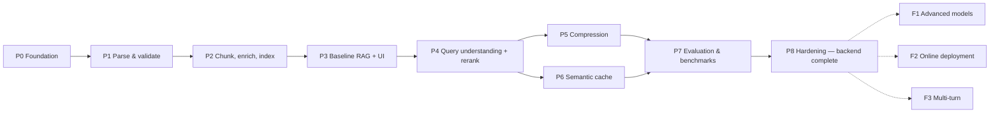

# Implementation Plan — Advanced Multimodal RAG for Balance Sheet Analysis (NVIDIA FY2026)

| Field | Value |
|---|---|
| Document version | v1.0 |
| Date | 17 September 2026 |
| Companion documents | [`problemstatement.md`](./problemstatement.md) (what and why) · [`architecture.md`](./architecture.md) (how, with decision log) |
| Build scope | Backend + localhost HTML test UI, Groq models only [B7-Q2][B7-Q3] |
| Out of this plan | Online deployment, advanced models, multi-turn — listed as future steps F1–F3 |

Section references such as **§5.9** point to `architecture.md`. **FR-/NFR-** ids point to `problemstatement.md`. **D-nn** ids point to the architecture decision log.

---

## 1. Ground rules for the build

| # | Rule | Why |
|---|---|---|
| G1 | **Localhost only.** The server binds to `127.0.0.1:8000`; no containers, no hosting work. | Agreed in review round 2 (D-44). Deployment is decided after the backend is complete. |
| G2 | **Groq only.** `MODEL_PROFILE=groq_build`; no Anthropic/Gemini calls. Their templates exist and are validated in Phase 8. | D-45 |
| G3 | **The UI is usable after every phase from Phase 3 onward.** Each component adds its own panel to the debug view. | Test queries and caching visually as the system grows (D-48). |
| G4 | **Deterministic code is test-first.** Slots, calculator, fidelity guard, slot guard, LFU math, and classifier rules get unit tests before or with the code. | These are where silent financial errors would hide. |
| G5 | **Every "advanced" component lands with evidence.** Each ships with a test, an ablation, or a report, and a null result is documented rather than hidden. | Problem statement §11 success criteria. |
| G6 | **One phase = one branch = one PR.** Branch name `phase-<n>-<slug>`; PR description lists the exit-criteria checklist. | Clean history and reviewable progress. |
| G7 | **Decisions that change during a phase update `architecture.md`.** Edit the decision log entry and the affected section in the same PR. | Documents stay the single source of truth. |
| G8 | **Protect the Groq quota.** Pace requests, cache enrichment outputs, run evaluations on subsets, and always evaluate with `bypass_cache=true`. | Free-tier per-minute limits are low (§7.2). |

---

## 2. Phase overview

| Phase | Name | Goal | Depends on | Relative size |
|---|---|---|---|---|
| 0 | Foundation and Groq model layer | Repo, environments, config, swappable `llm.py` with pacing and usage ledger | — | S |
| 1 | Ingestion I — parse and validate | Trustworthy structured parse of the PDF, with statement tables validated | 0 | M |
| 2 | Ingestion II — chunk, enrich, index | Semantic chunks, row facts, figures, sidecars, Chroma + BM25 index | 1 | L |
| 3 | Baseline RAG + localhost UI | End-to-end answers with citations and calculator in the browser; embedder locked | 2 | L |
| 4 | Query understanding and reranking | Slots, scope gate, expansion, gated reranking | 3 | M |
| 5 | Compression classifier | Gated, fidelity-safe compression | 4 | M |
| 6 | Semantic cache | Two-tier cache with Redis-style LFU, TTL classes, dev clock | 4 (5 recommended) | L |
| 7 | Evaluation and benchmarks | Cache benchmark, ablations, RAGAS, Stage C classifier, Ops panel | 5, 6 | M |
| 8 | Hardening — backend complete | Degrade modes, README, fresh-clone run, model-swap dry run | 7 | S |



**Why the cache (P6) comes after query understanding (P4), not before:** the slot guard (§5.8) depends on the slot extractor built in P4. A cache built earlier would have to rely on cosine similarity alone, which is exactly the false-hit risk the design exists to prevent (FY2026 vs FY2025 questions).

**Why compression (P5) is recommended before the cache (P6):** compression changes the answer pipeline's outputs and token costs. Calibrating cache admission and measuring "tokens saved" is cleaner once the pipeline it caches is stable. P5 and P6 can still run in parallel if needed, because the cache's `retrieval_config_hash` isolates entries across pipeline changes.

---

## 3. Requirements traceability

| Requirement | Built in phase | Verified in phase |
|---|---|---|
| FR-1 Multimodal retrieval | 1, 2, 3 | 3 (G12, G13), 7 |
| FR-2 Semantic chunking into ChromaDB | 2 | 2 (tests), 3 (embedder gate) |
| FR-3 Expansion, compression, reranking | 4, 5 | 4, 5 ablations |
| FR-4 Compression classifier | 5 | 5, 7 |
| FR-5 Semantic caching | 6 | 6 walkthrough + adversarial set |
| FR-6 Small vs large models; swappable profiles | 0 | 0 smoke test, 8 dry run |
| FR-7 TTL / eviction strategy | 6 | 6 (dev clock), 7 benchmark |
| FR-8 Calculator | 3 | 3 golden values |
| FR-9 Citations | 3 | 3 verifier tests |
| FR-10 Out-of-scope handling | 4 | 4 (G14) |
| FR-11 Telemetry | 0 (ledger), 3 (traces) | 7 Ops panel |
| FR-12 Localhost UI | 3, extended in 4–7 | every phase from 3 |
| FR-13 Single-turn scope | 6 (admission rule) | 6 |

---

## Phase 0 — Foundation and Groq model layer

**Goal:** a clean repository where any later phase can call Groq through a swappable, paced, logged model layer.

**Architecture references:** §7 (profiles), §8.8 (dependency files), §10 (layout), §11.2–11.3 (config), §9.4 (usage ledger).

### Tasks

**Repository and environments**
- [ ] Create the repository and the folder layout from §10; add `.gitignore` covering `.env`, `data/` (except sample manifest), and virtual environments.
- [ ] Create two Python 3.11 virtual environments (D-49):
  - `.venv-ingest` from `requirements-ingest.txt` (Docling, spaCy, and the rest of the ingestion stack).
  - `.venv` from `requirements-dev.txt` (serving + dev tools).
- [ ] Pin versions (lock/freeze) once both environments install cleanly; commit the pinned files.
- [ ] Add a `Makefile` with targets `setup`, `ingest`, `serve`, `test`, `lint`, `eval`, `bench`, `smoke`.
- [ ] Configure `ruff` and `pytest` (`pyproject.toml` or `ruff.toml` + `pytest.ini`).

**Settings and configuration**
- [ ] `.env.example` with `GROQ_API_KEY=`, `MODEL_PROFILE=groq_build`, `APP_ENV=dev`.
- [ ] `core/settings.py` using pydantic-settings; fail fast if `GROQ_API_KEY` is missing when the active profile uses Groq.
- [ ] Config loader with Pydantic schemas for `models.yaml`, `app.yaml`, `thresholds.yaml` (glossary, formulas, and fiscal calendar get schemas in later phases).
- [ ] `models.yaml` with the active `groq_build` profile and the inactive `anthropic` and `gemini` templates (§11.2). Templates must pass schema validation now.
- [ ] Record Groq limits for each model from the Groq console in `models.yaml` `pacing`.

**Model layer (`src/rag/llm.py`)**
- [ ] `LLMClient` resolving roles `small`, `large`, `vision` through the active profile.
- [ ] Methods: `text(prompt, role)`, `json(prompt, schema, role)`, `vision_json(prompt, images, schema)`.
- [ ] Lazy provider import: only `langchain-groq` is imported for `groq_build`.
- [ ] JSON handling for Groq: request JSON mode, validate with the Pydantic schema, and on failure retry once with the validation error appended; then raise a typed error.
- [ ] Client-side pacing: token bucket for requests per minute and tokens per minute, estimated with `tiktoken` before the call.
- [ ] Retries with `tenacity`: exponential backoff with jitter on 429/5xx, honouring `retry-after`.
- [ ] Usage ledger: append to `data/logs/llm_usage.jsonl` (§9.4) for every call, including retries and failures.
- [ ] `core/logging.py`: structured logging with API-key redaction.

**Smoke test**
- [ ] `scripts/smoke_llm.py`: one `text` call (`small`), one `json` call (`large`) with a tiny schema, and one `vision_json` call using a local test image.

### Tests
- Settings: missing key → clear error; `APP_ENV` parsing.
- Config: all three profiles validate; a deliberately broken template fails validation.
- JSON retry: mocked client returns invalid JSON first, then valid → one retry, success logged.
- Pacing: simulated burst beyond the RPM limit waits instead of calling.
- Log redaction: a logged dict containing the API key is masked.

### Groq usage
3 smoke calls per run.

### Exit criteria
- [ ] `make smoke` succeeds for all three roles and writes three ledger lines.
- [ ] `make test` and `make lint` pass.
- [ ] README stub explains environment setup.

---

## Phase 1 — Ingestion I: parse and validate

**Goal:** a structured, validated representation of the PDF that later stages can trust — especially the financial statement tables.

**Architecture references:** §3.1 (parsing), §3.2 (sections), §3.5 steps 1–2 (figure detection, rasterization), problem statement §2 (corpus profile).

### Tasks

**Parsing**
- [ ] `ingest/parse.py`: Docling conversion with layout analysis, table structure, and picture image generation enabled; save the Docling JSON to `data/parsed/docling.json`. Skip re-parsing when the PDF hash is unchanged.
- [ ] Spot-check reading order on p. 13 (the multi-column letter page) and record the result in the ingestion report.

**Sections and element typing**
- [ ] `ingest/sections.py`: seed page ranges — `annual_review` 1–18, `proxy` 19–88, `form_10k` 89–174, `back_cover` 175 — then refine `subsection` from Docling headings (10-K Items, proxy sections).
- [ ] Element typing: `text`, `heading`, `table`, `picture`, with page, bounding box, and section attached.
- [ ] Statement page detection by heading: Consolidated Balance Sheets, Consolidated Statements of Income, Consolidated Statements of Cash Flows.

**Validation (`ingest/validate.py`)**
- [ ] pdfplumber extraction of each statement table.
- [ ] Numeric normaliser: `$`, thousands separators, parentheses → negative, em dash → null, footnote markers stripped.
- [ ] Cell-by-cell comparison of the Docling and pdfplumber parses; pdfplumber wins on numeric disagreement; every disagreement is logged.
- [ ] Accounting identity assertion: Total assets = Total liabilities and shareholders' equity, for both columns (206,803 and 111,601). **Failure stops ingestion.**

**Figure candidates**
- [ ] Collect picture elements plus pages with dense vector drawing operations; p. 123 (vector stock chart) must appear.
- [ ] Rasterize figure crops (PNG, for the vision model) and page thumbnails (WebP, for the UI) with pypdfium2 into `data/index/figures/` and `data/index/pages/`.

**Report**
- [ ] `data/parsed/ingestion_report.json` and a short Markdown summary: counts by element type and section, table count, figure candidates, validation results, reading-order spot check.

### Tests
- Numeric normaliser: `"$ 10,605"` → 10605, `"(1,234)"` → −1234, `"—"` → null.
- Balance sheet parse (p. 141): `Inventories` = 21,403 / 10,080; `Total current liabilities` = 32,163 / 18,047.
- Identity check passes on real values and fails on a deliberately altered copy.
- Section mapping: pages 18, 19, 88, 89, 175 land in the expected sections.
- Figure candidates include p. 3 and p. 123.

### Groq usage
None.

### Exit criteria
- [ ] Both parsers agree on every numeric balance-sheet cell, or disagreements are resolved and logged.
- [ ] Identity holds for both periods.
- [ ] p. 13 reading order is correct in the parse.
- [ ] Ingestion report committed to `docs/reports/ingestion_phase1.md`.

---

## Phase 2 — Ingestion II: chunk, enrich, index

**Goal:** the complete, reproducible index: semantic chunks, table and row-fact chunks, figure chunks, sentence sidecars, Chroma collection, BM25 index, and manifest.

**Architecture references:** §3.3 (semantic chunking), §3.4 (tables and row facts), §3.5 (figures), §3.6 (embedding and indexing), §3.7 (multimodal strategy), §7.3 (enrichment caching), §9.1 (metadata schema).

### Tasks

**Sentences and semantic chunking**
- [ ] spaCy blank English pipeline with `sentencizer` plus custom exceptions; a fixture file of tricky filing sentences ("U.S.", "Inc.", "$0.001 par value", "Item 1A.").
- [ ] `ingest/chunk_semantic.py`:
  - Structural blocks bounded by headings, tables, figures, and section changes.
  - Neighbour-distance splitting with a corpus-level 90th-percentile threshold.
  - `MIN_TOKENS` 120 and `MAX_TOKENS` 450 guards.
  - Breadcrumb prefix on every chunk.
- [ ] Sentence sidecars: `sentences.jsonl` (sentence id, chunk id, text, offsets) and `sentence_emb.npy`.

**Tables**
- [ ] `ingest/tables.py`: a parent table chunk per table (Markdown + summary), with large tables split by row groups and the header repeated.
- [ ] Row-fact chunks for statement tables, with `line_item`, `line_item_norm`, `line_group`, `value_fy2026`, `value_fy2025`, `unit`, `parent_id`, `page`.
- [ ] Table one-line summaries via the `small` role, cached through `enrich.py`.

**Figures**
- [ ] `ingest/figures.py` + `enrich.py`: `vision_json` classification and description using the schema in §3.5; cache results at `data/parsed/enrichment/{sha256}__{model_id}.json`.
- [ ] Drop `photo`, `logo`, `decorative` figures (the p. 5 render must be dropped).
- [ ] Link companion tables by header/axis-label overlap on the same page (p. 123 chart ↔ its data table).
- [ ] Figure chunks carry `image_path` and `page_image_path`.

**Indexing**
- [ ] `ingest/index.py`:
  - Embed all chunks with fastembed `bge-small-en-v1.5` (default). Support `--embedder bge-base` to build a second index under `data/index_bge_base/` for the Phase 3 gate.
  - Create Chroma `report_chunks` with `embedding_function=None`, cosine space, full metadata.
  - Build the BM25 index with a finance-aware tokenizer (keeps numbers, `$` amounts, hyphenated product names) → `bm25.pkl`.
  - Write `manifest.json`: PDF hash, ingestion config hash, enrichment model ids, embedder id, chunk counts by modality, `corpus_version`.
- [ ] `make ingest` is resumable (enrichment cache) and idempotent (same inputs → same `corpus_version`).
- [ ] `scripts/inspect_index.py`: filter by modality, page, and section, and run a raw dense or BM25 query for debugging.

### Tests
- Chunk token counts within bounds; no chunk crosses a section boundary.
- No table chunk splits a row; repeated headers present in split tables.
- Row fact `Inventories` has 21403 / 10080 and page 141.
- p. 5 decorative image absent from the index; p. 123 figure present with `companion_table_id` set.
- `corpus_version` changes when the ingestion config or an enrichment model id changes, and stays the same otherwise.
- Enrichment cache hit → zero ledger lines on re-run.

### Groq usage (estimate)
One `small` call per table summary (on the order of the number of detected tables) plus one `vision` call per figure candidate (a few dozen), paced. A second run makes **zero** calls.

### Exit criteria
- [ ] `make ingest` completes and prints chunk counts by modality.
- [ ] Second `make ingest` run: zero Groq calls in the ledger.
- [ ] `inspect_index.py` returns the balance-sheet row facts for "inventories" via BM25 and via dense search.
- [ ] Both `bge-small` and `bge-base` indexes exist for Phase 3.

---

## Phase 3 — Baseline RAG + localhost UI

**Goal:** questions answered end-to-end in the browser with citations and deterministic calculations. The embedding model is locked at the end of this phase.

**Architecture references:** §4.5 (hybrid retrieval, without expansion yet), §4.9 (context assembly), §4.10 (calculator), §4.11 (generation contract), §4.12 (verifier), §8.3–8.4 (FastAPI + frontend), §9.3 (traces), §12 (evaluation hygiene).

### Tasks

**Golden set v1**
- [ ] `eval/golden.jsonl` with ≥ 40 questions: G1–G15 from problem statement §10, plus explanatory, visual, and cross-section questions.
- [ ] Each question records intent, expected answer (numeric value + unit + period where applicable), and labelled supporting chunk ids.
- [ ] Human review of explanatory reference answers (open question 18.2-1).

**Retrieval and answer path**
- [ ] `query/retrieve.py`: dense (Chroma) top 30 + BM25 top 30 → RRF (k = 60) → top 8; small-to-big for row facts and companion tables.
- [ ] `query/assemble.py`: citation headers `[C3 | section › breadcrumb | PDF p.141 | modality]`; 2,500-token budget truncation by rank (compression arrives in Phase 5).
- [ ] `calc/calculator.py` + `config/formulas.yaml`: `current_ratio`, `quick_ratio`, `working_capital`, `debt_to_equity`, `liabilities_to_equity`, `equity_ratio`, `yoy_change_pct`, `yoy_change_abs`, `cash_and_investments`. Inputs come from row-fact metadata only.
  - Formula selection is keyword-based in this phase (full slots arrive in Phase 4).
- [ ] `query/generate.py`: prompt contract (§4.11) with JSON output schema, using the `large` role; `vision` role when a figure chunk is in context and the question is visual.
- [ ] `query/verify.py`: every number traceable to context or a calculation result; every citation id valid; one regeneration on failure; `confidence=low` otherwise.

**Orchestration and API**
- [ ] `graph.py`: LangGraph v1, linear — `retrieve → assemble → calculate → generate → verify`.
- [ ] `api/main.py` + `routes_ask.py`:
  - `POST /api/ask` (body: `question`, `bypass_cache` placeholder).
  - `GET /api/figures/{id}` and `GET /api/pages/{n}`.
  - `GET /api/trace/{request_id}`.
  - `GET /healthz` and `GET /readyz` (models and index loaded).
- [ ] Trace log writer (§9.3); `rss_mb` sampled per request.

**Frontend v1**
- [ ] `frontend/index.html`, `app.css`, `app.js` with vendored `marked` and `DOMPurify`.
- [ ] Ask box.
- [ ] Rendered answer.
- [ ] Citation chips → page thumbnail modal.
- [ ] Figure image for visual answers.
- [ ] Debug panel v1: retrieved chunks with dense/BM25/RRF scores, calculator inputs and result, tokens and latency per node.
- [ ] `scripts/ask_cli.py` for terminal testing.

**Evaluation and gates**
- [ ] `eval/run_eval.py`: numeric exact match (value, unit, period), recall@8, and MRR against labelled chunks; always `bypass_cache=true`.
- [ ] **Embedder gate** (`eval/embedder_gate.py`): run retrieval metrics on both indexes. Lock the winner in config, update D-34/D-47, and write `docs/reports/embedder_gate.md`. Tie-break rule: prefer `bge-small` unless `bge-base` improves recall@8 by ≥ 3 points.
- [x] Generator check: `openai/gpt-oss-120b` (default) vs `qwen/qwen3.8-27b` on a 15-question subset; keep the default unless the alternative is clearly better on exact match. (Model ids revised in Phase 0, D-50.) Run in Phase 4 — tied on accuracy, Qwen 60 s/answer under OTPM → default kept (`docs/reports/generator_check.md`).

### Tests
- Calculator against golden values: current ratio 3.91, working capital 93,442, quick ratio 3.14, debt-to-equity 0.054, total assets YoY +85.3%, inventories YoY +112.3%.
- Calculator reports missing inputs instead of guessing.
- Verifier flags an injected wrong number and an invalid citation id.
- API contract tests with `httpx`: `/api/ask` schema, `/readyz` before and after load.
- RRF fusion unit test on synthetic rankings.

### Groq usage (estimate)
About 1–2 calls per question; a full golden run of 40 questions ≈ 40–80 calls, paced.

### Exit criteria
- [ ] G1–G10 correct in the browser at `http://127.0.0.1:8000`, each with a working page citation.
- [ ] G12 or G13 (visual) answered with the figure shown.
- [ ] Embedder locked; report committed.
- [ ] Baseline metrics recorded in `docs/reports/baseline_phase3.md` (the reference point for every later ablation).

---

## Phase 4 — Query understanding and reranking

**Goal:** precise slots, scope handling, intent-aware expansion, and gated reranking. The slot extractor built here is also the foundation of the cache guard in Phase 6.

**Architecture references:** §4.2 (slots), §4.3 (scope gate), §4.4 (analysis and expansion), §4.5 (filters, small-to-big), §4.6 (rerank gate and reranker).

### Tasks

**Domain configuration**
- [x] `config/fiscal_calendar.yaml`: FY2026 ends 2026-01-25, FY2025 ends 2025-01-26 (extendable).
- [x] `config/glossary.yaml`: roughly 150 synonym → canonical metric/formula mappings, with schema validation.

**Slots and scope**
- [x] `query/slots.py` — rule-based, no LLM:
  - `entity` and `fiscal_periods` (including `AMBIGUOUS_2025` handling).
  - `metrics` and `statement`.
  - `direction`, `aggregation`, `time_anchor`.
  - Query normalization for the L1 key.
- [x] `query/scope.py`: rule-based `OUT_OF_SCOPE` detection (buy/sell/hold, price targets, live-market questions), with the `small` role as fallback on borderline scores; scoped refusal response without retrieval.

**Analysis and expansion**
- [x] `query/analyze.py`: rule-based intent first; one `small` JSON call returning intent, sub-questions, paraphrases, section hints, and `needs_image` when rules are not confident.
- [x] Expansion per the intent matrix in §4.4:
  - Glossary expansion.
  - Decomposition for computations.
  - At most 2 paraphrases.
  - Numbers-free HyDE for `EXPLANATORY` only. **Null result** (EXPLANATORY recall already 1.00) → `expansion.hyde: false` by default, D-23.
  - At most 4 retrieval queries.
- [x] Retrieval upgrades: metadata pre-filters from slots with an unfiltered retry when fewer than 3 results come back; calculator now selects formulas from slots.

**Reranking**
- [x] `query/rerank.py`: fastembed `bge-reranker-base` over the top 30 using the original query; gate conditions S1–S3; drop floor with `min_keep` 3. **Measured negative** (recall@8 0.95 → 0.91, ≈ 5 s per question) → `rerank.enabled: false` by default, D-24.

**Wiring**
- [x] Graph: add `normalize_and_extract_slots → scope_gate → analyze_and_expand → retrieve → rerank_gate/rerank → …`.
- [x] Debug panel v2: slots, intent (rule vs LLM), expansions, filters applied, rerank decision with skip reason, rerank scores.

**Evidence**
- [x] `eval/retrieval_ablation.py`: dense → +BM25 → +expansion → +rerank, reporting recall@8, MRR, exact match, and Groq calls per query → `docs/reports/retrieval_ablation.md`.

### Tests
- ≥ 50 slot cases, including:
  - "FY26", "fiscal 2026", "as of Jan 25, 2026", "last fiscal year", bare "2025".
  - "cash pile", "liquidity ratio".
  - increase vs decrease.
  - "upcoming annual meeting".
- Scope gate: G14 and paraphrases refused with zero retrieval calls; balance-sheet questions never refused.
- Rerank gate: each skip condition triggers on a constructed example and does not trigger on a counter-example.
- Numbers-free HyDE: generated passage containing digits is rejected and regenerated or dropped.

### Groq usage
Rule-confident queries add 0 calls; others add 1 `small` call.

### Exit criteria
- [x] Ablation report committed (`docs/reports/retrieval_ablation.md`); HyDE (D-23) and the reranker (D-24) marked as null / negative results and disabled by default.
- [x] No regression on G1–G10 — full golden re-run through the Phase 4 pipeline: `docs/reports/golden_phase4_claude.md` (48/48 answered, numeric exact match 100% of 35, keyword coverage 100%, calculator agreement 100%; generator `claude-sonnet-5` because the Groq daily window could not carry the run — D-45 note). The partial Groq run `golden_phase4` (34/48, all exact but C5) agrees.
- [x] `OUT_OF_SCOPE` handled without retrieval (G14, O2 and paraphrases; test `test_out_of_scope_is_refused_without_retrieval_or_model_calls`).
- [x] Debug panel shows slots, scope decision, expansion queries with filters, and the rerank gate decision for every query.

### Outcome (2026-09-18)
Retrieval-only on the 46 in-scope golden questions: dense 0.52 → +BM25 0.73 → +expansion 0.95 recall@8 (MRR 0.46 → 0.91, hit rate 1.00) with **zero model calls** for every golden question (all rule-confident). Groq usage for the phase: ≈ 20 `small` calls (ablation `+llm` arm and probes), no `large` calls.

---

## Phase 5 — Compression classifier

**Goal:** compression that happens only when it pays off, never touches protected numeric content, and proves it did not change a single figure.

**Architecture references:** §4.8 (compressors, fidelity guard), §6 (classifier stages A–B, break-even, logging, ablation).

### Tasks

**Features and decisions**
- [x] `compress/features.py`: all features in §6.3; `relevance_density` uses the sentence sidecars from Phase 2 (`sentence_relevance_tau` calibrated to 0.62 — a weak signal on bge-small, §6.8a).
- [x] `compress/classifier.py`:
  - Stage A rules R0–R6.
  - Stage B score.
  - `break_even()` in quota mode (`min_reduction_for_llm`), with the price mode present for future profiles.
  - Output `CompressionDecision` with a reason per chunk.

**Compressors**
- [x] `compress/compressors.py`:
  - `DEDUPE` — embedding cosine ≥ 0.95, merged citations (narrative chunks only — row facts of one statement embed within 0.95 of each other, §6.8a).
  - `ROW_SELECT` — header + query metrics + section total rows.
  - `EXTRACT_LIGHT` — sidecar sentence selection ± 1 neighbour.
  - `EXTRACT_LLM` — `small` role, verbatim sentence copy.
- [x] `compress/fidelity.py`: every number in compressed text must appear verbatim in the source chunk; otherwise revert to the original chunk and log a violation.

**Wiring and logging**
- [x] Graph: `compression_classifier → compressors` between rerank and assemble; the context budget now fills after compression instead of by truncation.
- [x] Log feature vectors, decisions, and outcomes to `data/logs/compression_decisions.jsonl` (training data for Stage C in Phase 7).
- [x] Debug panel v3: per-chunk action and reason, tokens before and after, fidelity guard result.

**Evidence**
- [x] `eval/compression_ablation.py`: `never_compress` vs `always_compress` vs `classifier_gated` → accuracy, tokens, Groq calls, latency, violations → `docs/reports/compression_ablation.md`.

### Tests
- Table-driven rule tests: tables and row facts never reach `EXTRACT_LLM`; contexts under the skip budget make no compressor calls.
- Fidelity guard: altered digit → revert; reordered but verbatim sentences → pass.
- H20 duplicate case: repeated disclosures are deduplicated, and citations are merged.
- `ROW_SELECT` on the balance sheet for a current-ratio question keeps current assets, current liabilities, and totals.

### Groq usage
`EXTRACT_LLM` calls only when gated; the ablation's `always_compress` arm is the expensive one, so run it on a subset of about 20 questions.

### Exit criteria
- [x] Zero fidelity violations reaching generation across the golden set (guard reverts before generation; see `docs/reports/compression_ablation.md`).
- [x] `classifier_gated` accuracy ≥ `never_compress` accuracy, with fewer large-model input tokens; otherwise, document why and adjust thresholds — see the ablation report's reading.
- [x] Decision log file populated for Phase 7 training (`data/logs/compression_decisions.jsonl`, one line per request with features, decisions, applied actions and outcome).

---

## Phase 6 — Semantic cache

**Goal:** a two-tier semantic cache that is safe (no wrong-period answers), standard (Redis `volatile-lfu` semantics), and fully testable on localhost, including TTL expiry via the dev clock.

**Architecture references:** §5 (entire section), §14.3 (dev clock), D-01–D-09, D-28, D-30, D-31, D-46.

### Tasks

**Foundations**
- [x] `core/clock.py`: single `now()` used by TTL, LFU decay, sweeper, and time-anchored rules; the dev offset applies only when `APP_ENV=dev`. *Built:* `Clock(allow_offset, max_offset_days)`; log `ts` fields deliberately stay on the wall clock (they record when something happened) with `clock_offset_s` in every trace (§14.3 as built).
- [x] `cache/versions.py`: `corpus_version` (from manifest), `prompt_version` (hash of prompt templates), `generator_model`, `retrieval_config_hash` (thresholds + embedder + reranker + glossary hash), `calculator_version` (formulas hash). *Built:* hashes over parsed YAML (comment edits do not flush); `generator_model` = large + vision ids.

**Tiers**
- [x] `cache/l1.py`: `cachetools.TTLCache` (512 entries, ≤ 1 h, LRU) keyed by the normalized query + version keys (per-entry `min(class TTL, 1 h)` checked lazily).
- [x] `cache/l2.py`: Chroma `semantic_cache` in `data/cache/chroma` using the §5.11 schema; lookup with the slot guard `where` clause; promote hits to L1. *Built:* guard extended to seven keys, thresholds calibrated to 0.85 / 0.90, canonical embedded text (D-59); exact cosine over the filtered set (as D-54).
- [x] `cache/ttl.py`: TTL classes (30 d / 7 d / 1 d / 1 d / not cached); time-anchored expiry shortened to the referenced event date when that event is still in the future (dates parsed from the answer text).
- [x] `cache/admission.py`: the five admission rules (§5.6); refusals L1-only; rule 4 is a follow-up heuristic (v2 hook).
- [x] `cache/lfu.py`: Redis-style counter (`LFU_INIT_VAL` 5, log factor 10, 1-day decay), `on_hit`, `decayed`, `make_room` with tie → soonest expiry. Constants verified against redis.io / `redis.conf` on 2026-09-18 and noted in D-30.
- [x] `cache/sweeper.py`: on startup and every 15 minutes (FastAPI lifespan background task), delete expired entries. *Deviation (D-59):* version-mismatched entries are counted, evicted first under capacity pressure and removable with `purge stale`, but not deleted on sight — walkthrough step 7 needs them to survive a config revert.

**Wiring and API**
- [x] Graph: `cache_lookup` after `slots` (needs the L1 key and guard) and before the scope gate; `cache_write` after verify and for scoped refusals; `bypass_cache` skips both.
- [x] `api/routes_admin.py` (dev mode; 404 outside `dev_clock.enabled_in`) — plus `POST /api/admin/cache/sweep` and purge scopes `stale` / `l1`:
  - `GET /api/admin/cache/stats` (tier counts, hit rates, entries by TTL class).
  - `GET /api/admin/cache/entries` (paged, with slots, `expires_at`, `lfu_counter`).
  - `POST /api/admin/cache/purge` (all / class / slot).
  - `POST /api/admin/clock` (`offset_seconds`; reset).

**Frontend and calibration**
- [x] Cache panel in the UI (v4): tier badge, similarity / threshold, TTL class, `expires_at`, `lfu_counter`, hit count, admission outcome on a miss, bypass toggle, purge / sweep buttons, entries table, clock buttons (+1d, +7d, +30d, reset) with the current offset highlighted.
- [x] `eval/adversarial_cache_pairs.jsonl` (286: period swaps 66, metric swaps 66, direction swaps 72, negations 32, same-slot other-question 50) and `eval/paraphrase_pairs.jsonl` (52), generated by `eval/build_cache_pairs.py`.
- [x] Threshold calibration script (`eval/cache_threshold_calibration.py`) → adjusted to 0.85 / 0.90 with canonical embedded text and three extra guard keys → `docs/reports/cache_threshold_calibration.md` (D-59).

### Cache walkthrough (manual, in the browser; also scripted as `scripts/cache_walkthrough.py`)

Scripted result: `docs/reports/cache_walkthrough.md` — 10/10 on the `anthropic` profile; steps 1–6 also passed on `groq_build` before the day's token window ran out (steps 7–9 then returned degraded answers, correctly not admitted).

| Step | Action | Expected |
|---|---|---|
| 1 | Ask "What were NVIDIA's total assets as of Jan 25, 2026?" | `MISS`; answer $206,803M; admitted as `filed_fact` |
| 2 | Ask the same question again | `L1` hit, no Groq call in the ledger |
| 3 | Restart the server; ask again | `L2` hit (L1 was empty), promoted to L1 |
| 4 | Ask "Total assets at the end of fiscal 2026?" | `L2` hit (paraphrase, same slots) |
| 5 | Ask "What were total assets as of Jan 26, 2025?" | `MISS` — period slot differs (G15) |
| 6 | Toggle bypass cache; ask step 1 | Pipeline runs; no cache read or write |
| 7 | Change a retrieval threshold in `thresholds.yaml`; restart; ask step 1 | `MISS` — `retrieval_config_hash` changed. Revert the change, restart, ask again → `L2` hit on the original entry |
| 8 | Ask "When is NVIDIA's annual meeting?"; advance clock +1 day; ask again | First: `MISS`, admitted as `time_anchored`. Second: `MISS` (1-day TTL expired) |
| 9 | Advance clock to +31 days; ask step 1 again | `MISS` — `filed_fact` 30-day TTL expired; sweeper removes the stale entry |
| 10 | Reset clock; purge all | Stats show zero entries |

### Tests
- Slot guard: every adversarial pair misses; paraphrase pairs above threshold hit.
- Version invalidation: changing any version key → miss.
- TTL: fake clock past `expires_at` → miss; sweeper deletes the entry.
- LFU with a seeded RNG: counter increment probabilities follow the formula; decay reduces the counter by elapsed periods; `make_room` evicts lowest decayed counter, tie → soonest expiry.
- Admission: low-confidence, uncited, out-of-scope, and failed-verification answers are not written to L2.
- Persistence: L2 entries survive a process restart.

### Groq usage
Cache hits cost zero calls; the walkthrough costs about 6 full-pipeline runs.

### Exit criteria
- [x] False-hit rate ≤ 1% on the adversarial set (NFR-3) — 0.0 % on 286 pairs (`docs/reports/cache_threshold_calibration.md`).
- [x] All 10 walkthrough steps behave as expected, scripted (`docs/reports/cache_walkthrough.md`); the browser pass was not repeated by hand.
- [x] Cache hit p50 < 300 ms on localhost (NFR-5) — L1 6–12 ms, L2 29–40 ms in the walkthrough.

---

## Phase 7 — Evaluation, benchmarks, and classifier training

**Goal:** the evidence package: every advanced component measured, the cache policy decision tested against challengers, and the Stage C classifier trained.

**Architecture references:** §5.10 (cache benchmark), §6.7 (Stage C), §6.9 (ablation), §12 (evaluation table).

### Tasks

**Cache-policy benchmark**
- [x] `eval/cache_benchmark.py`:
  - [x] Synthetic query log on a simulated clock: 5,230 queries over 746 identities, Zipf s ≈ 1.1, three bursts. *Deviation:* the one-off tail is 630 questions (12 %, not 20 %) — that is every distinct one-off a single-company corpus affords; the script reports the cap rather than looping (a bug the first draft had).
  - [x] Policies: Redis-style LFU + TTL (chosen), LRU + TTL, LFU without decay, `volatile-ttl`, FIFO, MRU, Random, TTL-only — plus `lru_no_ttl`, added so the stale-hit column is not zero by construction.
  - [x] Capacities 100 / 500 / 1,000, **plus 25 and 50**: the working set is smaller than 500, so at 500 and 1,000 every policy is identical and there is nothing to compare (reported as the "eviction is inert at demo scale" measurement).
  - [x] Promotion rule (D-32) applied → `docs/reports/cache_policy_benchmark.md`. Chosen policy stands; LRU beats it by 5.5 pp at capacity 25 only.
  - [x] The benchmark also caught two real guard defects, fixed and re-measured (D-60): annual-meeting vs record-date, and "where is X disclosed" served X's value.

**Classifier and quality**
- [x] `eval/train_classifier.py`:
  - [x] Labels from the decision log joined to a forced `--compression always` run over the golden set (`stagec_always`) against the no-compression run: 54 chunk decisions, 46 positive.
  - [x] Logistic regression and gradient boosting under repeated stratified CV, with a bootstrap CI and an "always compress" base-rate row.
  - [x] Logistic weights exported to `src/rag/compress/classifier_weights.json`.
  - [x] Stage B switched behind `compression.stage_b: rules | learned`; the NumPy scorer matches scikit-learn to 1e-9 (`tests/test_eval_harness.py`).
  - [x] Rules vs learned compared on the same labels (precision 0.881 vs 0.919, base rate 0.852). **Not adopted** (D-61): 8 negative labels cannot separate the model from the base rate, so the generation-level ablation was not re-run — it would measure a policy the project is not shipping.
- [x] RAGAS-style metrics on a 16-question golden subset (faithfulness, answer relevancy, context precision/recall), labelled "indicative, same-family judge" → `docs/reports/ragas_groq.md` (Groq judge, 4 questions before the 200K-token daily window closed) and `docs/reports/ragas_claude.md` (the full subset). *Deviation (D-62):* the `ragas` package cannot be imported in this environment — it imports `langchain_community.chat_models.vertexai`, removed from the sunset `langchain-community` 0.4.2 — so the four metric definitions are implemented against the project's own `LLMClient`.

**Operations**
- [x] Ops panel in the UI via `GET /api/admin/stats` (`src/rag/api/ops.py`): cache hit rate over time as a sparkline, tokens and calls by role with pacing waits and retries, verification failures with their issues, compression decision mix and tokens saved, per-node latency percentiles, `rss_mb`.
- [x] Local resource profile: 50 mixed queries (60 % fresh → cache misses, 40 % repeats → hits) → startup stages, peak RSS, p50/p95 per node → `docs/reports/local_resource_profile.md` (`eval/resource_profile.py`).
- [x] NFR results table generated from the evidence on disk (`eval/nfr_results.py`) → `docs/reports/nfr_results.md`.

### Tests (`tests/test_eval_harness.py`)
- [x] Benchmark harness reproducibility: same seed → identical metrics, for every policy; the query log is byte-identical per seed and burst windows hold.
- [x] NumPy scorer matches scikit-learn predictions (max |Δp| < 1e-9), the feature order is asserted against the trainer's, and a reordered weights file is rejected.
- [x] Simulation invariants (hits + misses = queries, correct + false = hits, a TTL-respecting policy never serves an expired entry) and the promotion rule's two-capacity requirement.
- [x] Ops aggregation over synthetic logs, including a half-written JSONL tail.

### Groq usage
The benchmark uses no LLM calls (simulated). RAGAS and retraining runs are the main cost; use subsets and pace them.

### Exit criteria
- [x] All reports exist in `docs/reports/`: `cache_policy_benchmark.md`, `stage_c_classifier.md`, `ragas_groq.md`, `ragas_claude.md`, `local_resource_profile.md`, `nfr_results.md`.
- [x] Cache-policy decision confirmed per the promotion rule; D-32 accepted and D-30 annotated with the capacity-25 LRU result.
- [x] Stage C documented as **not adopted**, with the four adoption conditions and the one that failed (D-61).

---

## Phase 8 — Hardening: backend complete

**Goal:** a robust, documented, reproducible backend ready for the two decisions deferred by review round 2: advanced models (F1) and online deployment (F2).

**Architecture references:** §13 (failure modes), §14 (localhost), §7.1 (swap mechanisms), §16 (decision log).

### Tasks

**Robustness**
- [x] Degrade modes:
  - Groq 429 after retries → serve from cache if possible, else return a retrieval-only view (top cited chunks) with a clear message. *Built as an in-graph path (D-63): `generate` returns `degraded_answer` with citations, `degraded: true`, never admitted; the cache lookup before generation is the "serve from cache" part.*
  - Vision model unavailable → description + companion table answer. *D-55, unit-tested in `test_hardening.py`.*
- [x] Input limits: maximum question length; reject empty or binary input; request timeout. *`validate_question` (422) + `asyncio.wait_for` (504); limits in `app.yaml` and reported by `/readyz`.*
- [x] Startup checks: index manifest present and `corpus_version` consistent; bind address is `127.0.0.1`; admin and clock routes disabled outside dev mode. *`api/checks.py`; fatal checks leave the pipeline unloaded; plus a 403 guard for routable peer addresses (D-64).*

**Security and quality**
- [x] Log hygiene: redaction test for API keys; no full prompts containing secrets. *`test_logging_redaction.py` + Phase 8 tests: model-error messages redacted, ledger/trace schemas carry no prompt fields, `.env` gitignored.*
- [x] Coverage for deterministic modules (slots, calculator, fidelity, cache guard, LFU, classifier rules) ≥ 90%. *`scripts/coverage_gate.py`: 12 modules, lowest 92.9 %, overall 97.1 % — `docs/reports/coverage_phase8.md`.*

**Model-swap readiness**
- [x] `scripts/check_profile.py --profile anthropic --dry-run` (and `gemini`): validates config and resolves roles, with no network calls. *All four profiles pass — `docs/reports/model_swap_dry_run.md` (D-65).*
- [x] Write the F1 switch checklist into the README.

**Documentation and release**
- [x] README:
  - Overview diagram.
  - Localhost runbook.
  - How to run the cache walkthrough.
  - Component-by-component reasoning linked to the decision log.
  - Links to all reports.
- [x] Update `architecture.md` and `problemstatement.md` statuses (Proposed → Accepted or Revised based on evidence). *architecture v0.4: no decision left Proposed; D-63–D-65 added.*
- [x] Fresh-clone rehearsal: new directory → setup → ingest → serve → ask G1 and run the cache walkthrough, following the README only. *Pass on the second pass — the first found two defects (cp1252 console crash in every CLI script; a test assuming the F1 packages), both fixed: `docs/reports/fresh_clone_rehearsal.md`. Same `corpus_version` as the build machine.*
- [ ] Tag the release `v1.0-backend`. *After the post-Phase-8 commit (user instruction of 2026-09-18).*

### Exit criteria — backend-complete gate
- [x] Fresh-clone rehearsal succeeds. *`docs/reports/fresh_clone_rehearsal.md` (pass; 2 defects found and fixed).*
- [x] All phase exit criteria met, or deviations documented with root cause. *Deviations: D-23/D-24 null and negative results (kept off), D-45 evaluation runs on the `anthropic` profile, D-61 Stage C not adopted, D-62 in-repo RAGAS metrics; Groq golden re-run partial (34/48, `eval/run_eval.py --name golden_phase4 --resume` completes it) — each recorded in the decision log and the phase outcome notes above.*
- [x] Dry-run checks pass for the `anthropic` and `gemini` templates. *`model_swap_dry_run.md`.*
- [x] Deferred-decision list (architecture §14.4) reviewed and ready for discussion. *README → Deferred decisions; architecture §14.4.*

### Outcome (2026-09-19)
Robustness: model failures degrade inside the graph to a cited retrieval-only view (never cached, latencies kept); input validation (422) and a request timeout (504); startup checks (`bind`, `admin`, `secrets`, `index`) reported by `/readyz`, a loopback guard (403). Quality: 12 deterministic modules at 92.9–100 % coverage (97.1 % overall) behind `make coverage`; 473 tests, ~45 s, no network. Model swap: all four profiles pass the dry run; the run found that LangChain forwards unknown `provider_kwargs` silently, which the script now flags. Documentation: README rewritten around the runbook, the component table and the 19 reports; architecture v0.4 with every decision status set from evidence. Groq usage for the phase: the fresh-clone ingestion only (enrichment, separate `small`/`vision` daily buckets) plus the rehearsal's G1 and walkthrough calls; no new evaluation runs.

---

## Future steps (not scheduled; decided after the backend-complete gate)

### F1 — Switch to advanced models [B7-Q2]
1. Enable API billing for the chosen provider(s); add keys to `.env`; install `requirements-future.txt`.
2. Verify current model ids (especially Gemini) and set `MODEL_PROFILE`.
3. Fill the per-token price table (used by the compression break-even test, §6.6).
4. Run the golden set and RAGAS on each candidate profile → generator bake-off → choose the default (D-38).
5. Optional: re-enrich figures with the stronger vision model (changes `corpus_version`; cache invalidates automatically); re-run retrieval evaluation.
6. Re-run compression calibration, since the context budget rises from 2,500 to 6,000 tokens.
7. Update reports and the decision log.

### F2 — Online deployment (Render or similar) [B7-Q1][B7-Q3]
Decisions listed in architecture §14.4: host and size (from the Phase 7 resource profile), reranker size, cache persistence, containerization, access protection and rate limiting (D-43), and the model profile for the public demo.

### F3 — Multi-turn conversations and sessions [B6-Q4]
Session ids; rule-detected follow-ups condensed to standalone questions by the `small` role before slot extraction; session-scoped L1 and global L2; session TTL; multi-turn replay set measuring cache hit and false-hit rates across follow-ups (architecture §15).

---

## Appendix A — Localhost runbook (target state after Phase 3)

```bash
# one-time setup
python3.11 -m venv .venv-ingest && .venv-ingest/bin/pip install -r requirements-ingest.txt
python3.11 -m venv .venv        && .venv/bin/pip install -r requirements-dev.txt
cp .env.example .env            # add GROQ_API_KEY; keep MODEL_PROFILE=groq_build, APP_ENV=dev
cp /path/to/2026_NVIDIA_ANNUAL_REPORT.pdf data/raw/

# build the index (resumable; enrichment cached)
make ingest

# run the app
make serve                      # → http://127.0.0.1:8000  (API docs at /docs)

# checks
make test
make eval                       # golden set, bypass_cache=true
python scripts/cache_walkthrough.py   # after Phase 6
```

## Appendix B — Groq quota hygiene

| Practice | Where |
|---|---|
| Client-side RPM/TPM pacing from `models.yaml` | Phase 0 `llm.py` |
| Enrichment results cached by content hash + model id | Phase 2 |
| Rule-first intent; LLM analysis only when rules are unsure | Phase 4 |
| Compression calls only when the classifier's break-even test passes | Phase 5 |
| Cache hits cost zero calls | Phase 6 |
| Evaluations on subsets; always `bypass_cache=true` | Phases 3–7 |
| Usage ledger reviewed at the end of each phase | Every PR description includes Groq calls and tokens used |

## Appendix C — Per-phase PR checklist

- [ ] Exit criteria checklist copied into the PR and ticked.
- [ ] Tests and lint pass.
- [ ] Reports (if any) committed under `docs/reports/`.
- [ ] Decision log and affected architecture sections updated.
- [ ] Groq usage for the phase noted from the ledger.
- [ ] UI demo note: what to try in the browser to see this phase's feature.
